class: center, middle

```{css, echo=FALSE}
pre {
  max-height: 400px;
  overflow-y: auto;
}
pre[class] {
  max-height: 200px;
}
```

```{r setup, include=FALSE}
knitr::opts_chunk$set(echo = TRUE, warning = FALSE, message = FALSE, fig.align='center')
library(knitr)
library(ggplot2)
library(dplyr)
library(readr)
library(jtools)
```

```{r xaringan-themer, include=FALSE}
library(xaringanthemer)
style_mono_accent(
  base_color = "#1c5253",
  header_font_google = google_font("Josefin Sans"),
  text_font_google   = google_font("Montserrat", "300", "300i"),
  code_font_google   = google_font("Fira Mono"),
  text_font_size = "1.6rem"
)
```

---

## Block 1: Natural Experiments and Case Studies

---

### Module 2 Overview

**Today's Focus:**
- Natural experiments: when nature randomizes (or nearly does)
- True experiments: when we control randomization
- Pairing case studies with both frameworks
- Case selection strategies for experimental data

**Key Question:** How do we design qualitative components to test the assumptions that make experimental and natural-experimental designs valid?

---

### Typology of Natural Experiments

1. **Classic Natural Experiment:** "Nature" randomizes the treatment directly.
2. **Instrumental Variables-Type Natural Experiment:** "Nature" randomizes a cause of the treatment.
3. **Regression-Discontinuity Design (RDD):** Assignment based on a threshold on a continuous variable.

Each requires **different qualitative strategies** to validate assumptions.

---

### Classic Natural Experiment

**Definition:**
1. Nature randomizes the treatment.
   - All confounding variables (observable and unobservable) are balanced.
   - No discretion in assignment, or the relevant information is unavailable/unused.
2. The randomized treatment has the same effect as non-randomized treatment would have.

**Example:** Snow on Cholera (natural variation in water source).

---

### Qualitative Tasks for Classic Natural Experiments

- **Process trace the cause of the cause:** Why did "nature" assign treatment here and not there? Verify no human selection bias.
- **Process trace mechanisms inside vs. outside the experiment:** Does the treatment operate the same way in the natural experiment as it would in the broader population?

---

### Example: Vietnam War Draft Lottery

- **Natural Experiment:** Draft lottery randomly assigned birthdates to priority numbers.
- **Treatment:** Draft eligibility (instrument for military service).
- **Outcome:** Earnings, education, mortality.

---

```{r, echo=FALSE, out.width="70%"}
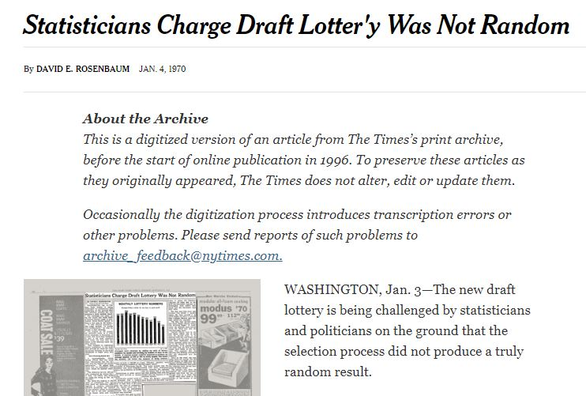
```
---
```{r, echo = TRUE, out.width="100%", fig.retina = 1, fig.align='center'}
draft1970 <- read_csv("data/draft1970.csv")
```
---
```{r, echo = TRUE, out.width="50%", fig.retina = 1, fig.align='center'}
boxplot(rank~month, data=draft1970)
```

---
```{r, echo = TRUE, out.width="100%", fig.retina = 1, fig.align='center'}
draftlm <- lm(rank ~ day, data=draft1970)
```
---
```{r, echo = TRUE, out.width="100%", fig.retina = 1, fig.align='center'}
summ(draftlm)
```
---
```{r, echo = TRUE, out.width="100%", fig.retina = 1, fig.align='center'}
draft1971 <- read_csv("data/draft1971.csv")
```
---
```{r, echo = TRUE, out.width="50%", fig.retina = 1, fig.align='center'}
boxplot(rank~month, data=draft1971)
```

---
```{r, echo = TRUE, out.width="100%", fig.retina = 1, fig.align='center'}
draft71lm <- lm(rank ~ day, data=draft1971)
```
---
```{r, echo = TRUE, out.width="100%", fig.retina = 1, fig.align='center'}
summ(draft71lm)
```

---

```{r, echo = FALSE, out.width="70%", fig.retina = 1, fig.align='center'}
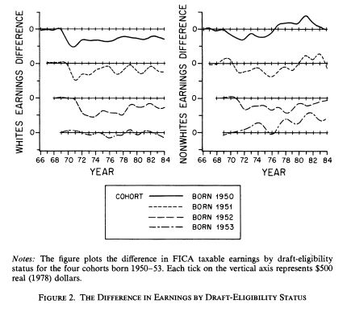
```

---

### IV Natural Experiment

**Definition:**
1. "Nature" randomizes a cause of the treatment ($Z$).
2. $Z$ only affects $Y$ through its effects on $X$ (exclusion restriction).
3. Treatment caused by $Z$ has the same effect as treatment with any other cause.

**Example:** Acemoglu, Johnson, and Robinson: Settler mortality as an instrument for institutional quality $\rightarrow$ economic development.

---

### Qualitative Tasks for IV Natural Experiments

- **Process trace backwards from the cause of the cause:** Why did settler mortality vary? Was it truly exogenous?
- **Process trace forward from $Z$ to $X$:** Does settler mortality *only* affect institutions, or does it also affect other pathways (e.g., disease environment $\rightarrow$ human capital)?
- **Process trace $X \rightarrow Y$ in matched pairs:** Compare a country with high predicted institutions (low settler mortality) to one with low predicted institutions (high settler mortality). Trace the institutional mechanisms.

---

### Example: Acemoglu, Johnson, and Robinson (2001)

```{r, echo=FALSE, out.width="60%", fig.retina = 1, fig.align='center'}
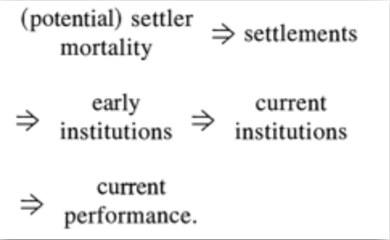
```

---

- $Z$ Settler mortality
- $X$ Institutions (protection of property rights)
- $Y$ GDP per capita

**Qualitative challenge:** Are there cases where settler mortality affected GDP through causal pathways other than institutions? Why?

---

### Regression-Discontinuity Design (RDD)

**Definition:**
1. There is an assignment variable $Z$.
2. Cases assigned to treatment if and only if $Z \geq T$ (threshold).
3. Enough cases near the threshold for local comparison.

**Key Assumption:** Units just above and just below $T$ are exchangeable except for treatment.

---

### Qualitative Tasks for RDD

- Assumptions 1 and 3 (threshold rule and density) can be checked quantitatively.
- **Assumption 2 (no manipulation of $Z$):** Process trace the cause of the assignment variable.
  - Who determines $Z$? Do actors know about the threshold? Can they game it?
  - Interview policymakers, administrators, or subjects to verify no sorting around the cutoff.

---

### Example: Maimonides' Rule (Angrist and Lavy 1999)

> "Twenty-five children may be put in charge of one teacher. If the number in the class exceeds twenty-five but is not more than forty, he should have an assistant... If there are more than forty, two teachers must be appointed."

- **$Z$:** Cohort enrollment count
- **Thresholds:** 41, 81, 121 (class size divides)
- **Treatment:** Actual class size

---

### Maimonides' Rule: The Discontinuity

```{r, echo=FALSE, out.width="45%"}
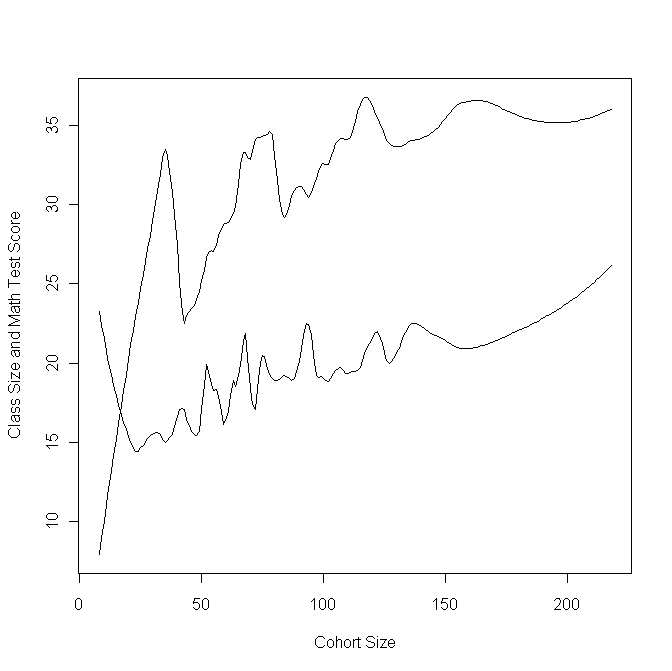
```

---

**Qualitative question:** Do principals manipulate enrollment counts to fall just below thresholds? Interview school administrators to verify.

---

### RDD Pitfalls

RDD is not valid if:
- Actors are aware of the discontinuity and adjust behavior (e.g., parents moving students to change cohort size).
- The assignment variable is coarsely measured, so cases near the threshold are not actually close.

**Qualitative research can help detect both problems.**

---

```{r, echo = FALSE, out.width="85%", fig.retina = 1, fig.align='center'}
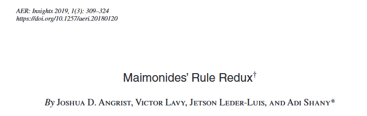
```

---

```{r, echo = FALSE, out.width="85%", fig.retina = 1, fig.align='center'}
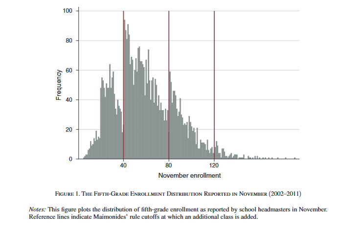
```

---

```{r, echo = FALSE, out.width="85%", fig.retina = 1, fig.align='center'}
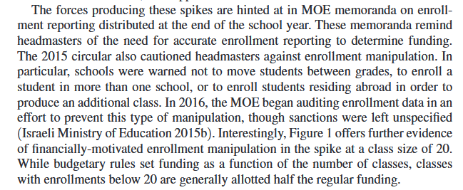
```


---

### Case Selection for Natural Experiments

| Design | Case Selection Strategy |
|:-------|:------------------------|
| Classic Natural Experiment | Extreme values of the cause; cases where mechanism is most visible |
| IV Natural Experiment | Extreme values of the instrument ($Z$); surprising values of treatment ($X$) given $Z$ |
| RDD | Cases with "power or privilege"; those just above/below threshold; also cases far from threshold to test generalizability |

---

class: center, middle

# Block 2: True Experiments and Multi-Method Integration

---

### Why Experiments Work

Random assignment ensures:

$\text{E}(Y_{i,1} | T_i = 1) \approx \text{E}(Y_{i,1} | T_i = 0)$

$\text{E}(Y_{i,0} | T_i = 1) \approx \text{E}(Y_{i,0} | T_i = 0)$

**There is a strong argument for some kind of causal inference.** 

---
##But what about:

- Meaning of the treatment?
- Measurement of the outcome?
- Mechanisms/causal pathways?
- Experimental and psychological realism?
- Spillovers?
- Exhaustiveness
- Heterogeneity

**Qualitative methods may contribute to these.**

---

### Example: Cross-Cutting Cleavages in Mali

**Dunning and Harrison (2010):** Does cousinage (a cross-cutting traditional tie) reduce ethnic voting?

- **Experiment:** Lab-in-the-field with Malian participants. Vignettes varied ethnicity and cousinage relationship of a candidate.
- **Finding:** Cousinage significantly reduces ethnic bias in voting.

**Video:** [Link to video](https://www.youtube.com/watch?v=LpjgD_zV0IY)

---

### Mali Cousinage: Results

```{r, echo=FALSE, out.width="60%"}
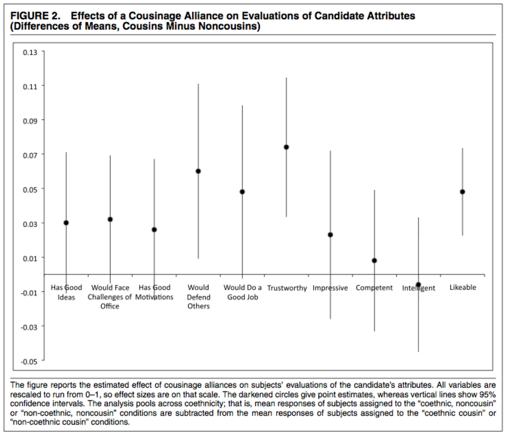
```

---

**Qualitative knowledge:** Prior qualitative information facilitated this design, allowing construction of the treatment and interpretation of names as group proxies. This reflected not just the researchers' fieldwork but generations of prior ethnographic knowledge.

---

### Issues for Experiments: What Qualitative Work Can Address

| Issue | Qualitative Approach |
|:------|:---------------------|
| Meaning of the treatment | Open-ended questions, think-aloud protocols |
| Measurement of outcome | Cognitive interviews, differential item functioning analysis |
| Networks / SUTVA violations | Ethnographic observation of participant interactions |
| Exhaustiveness  | Interviews with non-compliers |
| Moderation / heterogeneity | Case selection of "unusual" responders for follow-up |

---

### Experimental Realism

> "Experimental realism refers to impact in its most important sense: Do subjects believe the situation, problem, or issue they confront? Does it engage and interest them? Does it capture their attention?" (McDermott 2002: 333)

---

**Hypothetical qualitative method:** Immersive comparison of process inside and outside of experiment. Ask participants: *"What do you think about this information? What kind of agenda do you think this speaker has? Do you believe what you're being told about women's representation?"*

---

### Example: Anti-Americanism and Female Representation in Jordan

**Bush and Jamal (2015):** Does foreign pressure undermine support for women's representation?

- **Survey experiment:** Random sample of Jordanian adults.
- **Control:** Information about quota for women in parliament.
- **Treatment 1:** Adds mention of U.S. support for the quota.
- **Treatment 2:** Adds mention of religious leaders' support.

---

### Jordan Experiment: Results

```{r, echo=FALSE, out.width="70%"}
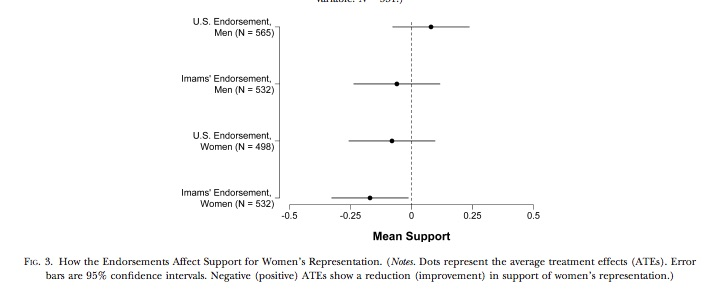
```

- **Finding:** U.S. endorsement *reduces* support for women's representation among those with anti-American attitudes.
- **Qualitative component didn't happen:** Why do you think that is? How does this change our feelings about the study?.

---

### SUTVA: Stable Unit Treatment Value Assumption

**Definition:** One unit's treatment does not affect another unit's outcome.

**Threat:** Spillover, contamination, network effects.

**Qualitative detection:** Ethnographic observation during experiment. Are participants talking to each other? Are they aware of other treatment conditions?

---

### Example: Electoral Fraud in Russia (Enikolopov et al. 2013)

- **Experiment:** Randomized assignment of independent observers to polling stations in Moscow.
- **Finding:** Observers reduce fraud at treated stations.

**SUTVA Concern:** Does placing observers at *some* stations displace fraud to *neighboring* unobserved stations?

---

### Russia Electoral Fraud: Spillover Map

```{r, echo=FALSE, out.width="70%"}
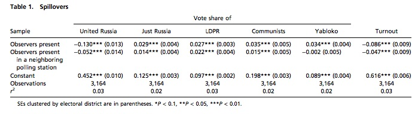
```

**Qualitative investigation:** Interviews with election officials and party operatives could have been used to find out what was happening here. Was fraud displaced via networks among party officials, which would be a SUTVA violation that we can correct via spatial econometrics once we understand the network? Or was the mechanism something else?

---
### Exhaustiveness


- **Encouragement design:** We randomly assign an *encouragement* to take up a treatment, but actual treatment uptake is voluntary.
- **Example:** Randomly mail some households information about a job training program. Some recipients enroll; some non-recipients enroll anyway.

- **Instrumental Variables (IV) setup:**
  - $Z$: Randomly assigned encouragement (instrument)
  - $X$: Actual treatment received (endogenous)
  - $Y$: Outcome of interest

---

### The Exhaustiveness Assumption

**Exhaustiveness** (also called the **exclusion restriction**):

> The instrument $Z$ affects the outcome $Y$ **only through** its effect on the treatment $X$.

---

In an encouragement design, this means:

- Receiving the encouragement ($Z = 1$) changes outcomes **only** because it increases the probability of taking up treatment ($X = 1$).
- There are **no alternative pathways** from $Z$ to $Y$.

.pull-left[
**Violation Example:**
Mailing job training info ($Z$) may:
- Increase self-efficacy ("Someone thinks I can do this!")
- Prompt the recipient to search for other jobs

These effects on $Y$ are *not* mediated by program enrollment ($X$).
]

.pull-right[
**Consequence:**
IV estimate is biased—it captures the effect of the *encouragement* plus the effect of the *treatment*, not the treatment alone.
]

---

### Testing Exhaustiveness Qualitatively

**Why qualitative methods?**  
The exclusion restriction cannot be tested using only the quantitative data. We must investigate the *process* by which $Z$ operates.

**Qualitative Strategies:**

1. **Process trace the encouragement:**
   - Interview participants: *"What did you think when you received the letter? Did it make you do anything besides consider the program?"*

---

2\. **Compare compliers and non-compliers:**
   - Interview those who received $Z$ but did **not** take up $X$. Did $Z$ affect their outcomes directly?

3\. **Ethnographic observation:**
   - Observe how the encouragement is delivered and received. Does the messenger influence outcomes independently?

**Key Question:** *"Can I tell a plausible story in which $Z$ changes $Y$ without changing $X$?"* If yes, exhaustiveness is threatened.

---
### Exhaustiveness and Emotion Treatments

Suppose I want to encourage people in a political-science experiment to feel anger. Which of the below videos is more likely to meet the exhausiveness standard?


.pull-left[

```{r, echo=FALSE, out.width="100%", fig.align='center'}
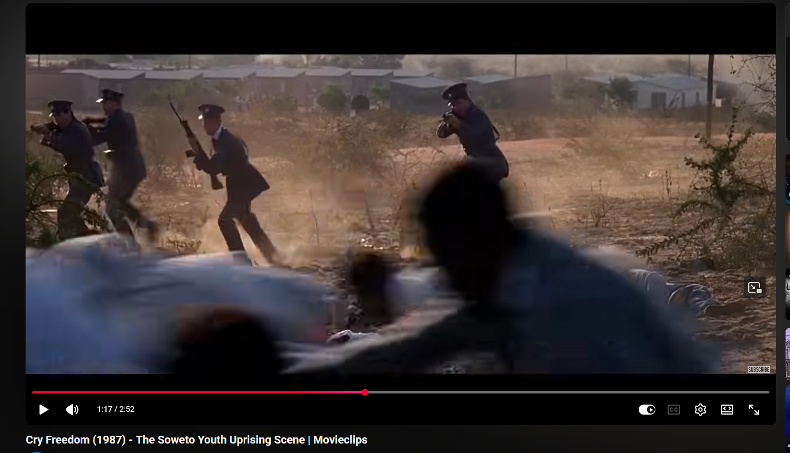
```

]

.pull-right[

```{r, echo=FALSE, out.width="100%", fig.align='center'}
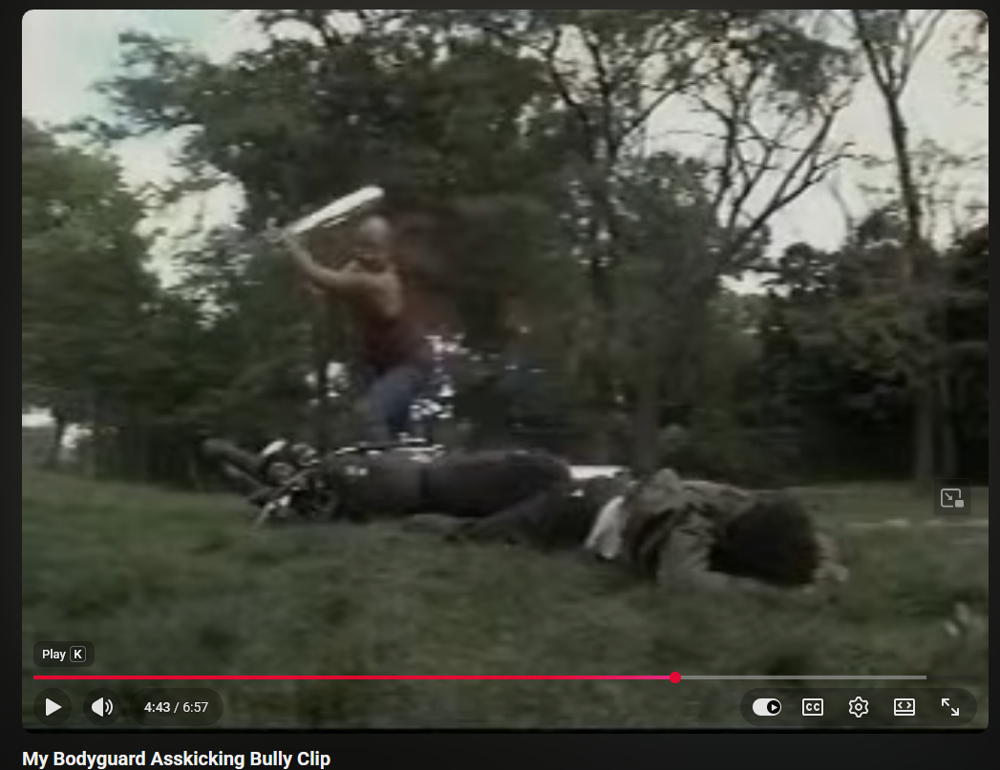
```

]

---

In selecting among these (and others), for use in an emotions-and-politics experiment in Peru, I set up focus groups where I asked participants to watch the clips from which the stills in the last slide were taken and discuss together their reactions. By recording the conversations, I can observe the effects of the treatments.

---

- Both of the videos in the last slide produced a lot of angry comments.
- The video about South Africa produced a lot of political discourse about racism and police violence, as well.
- The video about a teenage bully produced a lot of discussion about how mean teenagers are to each other, as well as personal memories.

---

### Tracing Causal Process in Experiments

> "Even when causal relationships are firmly established, demonstrating the mediating pathways is far more difficult—practically and conceptually—than is usually supposed." (Green, Ha, and Bullock 2010)

---

**Multi-Method Approach: Experimental Ethnography**

> "This strategy can achieve experiments that create both a strong 'black box' test of cause and effect and a rich distillation of how those effects happened inside that black box, person by person, case by case, and story by story." (Sherman and Strang 2004: 205)

---

### Process Tracing in Experiments: Practical Tools

- **MouseLab / Process Tracing Software:** Track what information participants access before making decisions.
- **Open-Ended Questions:** "Walk me through what you were thinking when you made that choice."
- **Think-Aloud Protocols:** Participants verbalize thoughts in real time.
- **Post-Experiment Interviews:** Semi-structured, exploring decision-making process.

---

### The Limits of Experimental Process Tracing

- We still won't fully test mediation theories --- as we said on the first day, the assumptions for such a test are severe.
- It is probably more useful to use these techniques as modes of hypothesis generation, and as ways of testing other assumptions we've discussed above.

---

### Case Selection for Experiments

**Challenge:** Experiments have treatment and control groups. Which participants do we interview?

| Goal | Case Selection Strategy |
|:-----|:-----------------------|
| Understand mechanism | "Typical" treatment and control cases (average treatment effect) |
| Explore heterogeneity | Extreme responders (very large or very small treatment effects) |

---

### Case Selection for Experiments
| Goal | Case Selection Strategy |
|:-----|:-----------------------|
| Diagnose non-compliance | Non-compliers in treatment group; always-takers in control |
| Test SUTVA | Participants spatially or socially proximate to other treatment arms |
| Test experimental realism | Random sample of participants for debriefing |

---

### Example: Ethnic Identity Experiment in Peru

**Research Question:** Does populist discourse shift ethnic self-identification?

**Design:**
- Survey experiment in Peru (low recent populism, stable ethnic identification).
- Treatments: Populist message, technocratic message, solidarity message.
- Outcome: Social distance from indigenous man, Afro-Peruvian man, professional woman.

---

### Peru Experiment: Treatments

**Populist Message:**
> "There is so much inequality in Peru because some powerful people who supposedly know best conspire with the government and transnational companies to steal the country's wealth for themselves. All of us who are part of the real Peruvian people are victims..."

**Technocratic Message:**
> "There is so much inequality in Peru because we're still in the intermediate steps of economic development. We need time, patience, investment..."

---

### Peru Experiment: Treatments


**Solidarity Message:**
> "There is so much inequality in Peru because our government has not done enough to support social and economic solidarity..."

---

### Peru Experiment: Social Distance Measures

```{r, echo=FALSE, out.width="30%"}


```

---

### Peru Experiment: Results

| Social Distance From... | Effect Estimate | $p$-value |
|:------------------------|:---------------:|:---------:|
| Indigenous Man          | 2.11            | 0.034     | 
| Afroperuvian Man        | 0.26            | 0.79      |
| Professional Woman      | 0.50            | 0.59      |

**Interpretation:** Populist message reduces social distance specifically toward indigenous people.

**Qualitative follow-up:** In-depth interviews with participants who showed large shifts. What did the message mean to them? Did it activate latent ethnic solidarity?

---

### Case Selection Summary: Experiments

| Goal | Select... |
|:-----|:----------|
| Test mechanism | Typical treatment/control cases |
| Explore why treatment works for some | High-responders (large individual treatment effects) |
| Explore why treatment fails | Low-responders, non-compliers |
| Test SUTVA | Geographically clustered participants |
| Test realism | Random debriefing sample |

**Key Insight:** The "surprising causes" logic from Module 1 can be adapted: select cases with **surprising treatment effects** (large residuals from predicted individual treatment effect).

---

class: center, middle

# Block 3: Hands-On Lab: Adding Qualitative Work to Natural/True Experiments

---

### Lab Objectives

1. Run an instrumental variables analysis (settler mortality $\rightarrow$ democracy $\rightarrow$ inequality).
2. Run an RDD analysis (Maimonides' Rule).
3. Identify assumptions and design qualitative follow-ups.
4. Design a multi-method experiment from scratch.

---

### Part 1: IV Natural Experiment (Settler Mortality)

```{r, eval=FALSE, echo=TRUE}
# Load data
inequality <- read.csv("data/inequality.csv")

# Install and load sem package if needed
# install.packages("sem")
library(sem)

# IV regression: Polity instrumented by SettlerMortality
ineqtsls <- tsls(Gini ~ Polity + GDP + Industry + FuelExports + CommunistLegacy, 
                 ~ SettlerMortality + GDP + Industry + FuelExports + CommunistLegacy, 
                 data = inequality)

summary(ineqtsls)
```

---

**Discussion Questions:**
- What is the estimated effect of democracy on inequality?
- What assumptions are required for this to be a valid causal estimate?
- Which countries have extreme values of SettlerMortality? What would you look for in a case study of one of those countries?

---

### Part 2: RDD (Maimonides' Rule)

```{r, eval=FALSE, echo=TRUE}
# Load data
library(foreign)
final4 <- read.dta("data/final4.dta")
final5 <- read.dta("data/final5.dta")

# Define Maimonides function
maimonides.fun <- function(cohortsize) {
  ifelse(cohortsize < 41, cohortsize,
         ifelse(cohortsize < 81, cohortsize/2,
                cohortsize/3))
}

# Run IV regression for 4th grade math scores
library(sem)
rddtsls <- tsls(avgmath ~ classize + c_size + tipuach, 
                ~ I(maimonides.fun(c_size)) + c_size + tipuach, 
                data = final4,
                subset = final4$c_size %in% c(36:45, 76:85, 116:125))

summary(rddtsls)
```

---

**Discussion Questions:**
- Is there evidence that smaller classes improve math scores?
- What threats to validity exist? (Manipulation of cohort size? Other policies at the threshold?)
- If you could interview one school principal, what would you ask?

---

### Part 3: Design a Multi-Method Experiment

**Task (small groups, 30 minutes):**

Choose one of the "impossible" topics below. Design an experiment that:
1. Randomly assigns a treatment.
2. Measures an outcome quantitatively.
3. Includes a qualitative component (interviews, focus groups, think-alouds) to test **SUTVA**, **experimental realism**, or **causal mechanisms**.

---

**Topics:**
- The effects of candidate gender on voter decision-making
- The democratic peace hypothesis
- Authoritarianism is a fixed personality trait
- Climate change increases salience of ethnic politics
- Social media makes people more polarized

**Deliverable:** Be prepared to share your design in 5 minutes.

---

### Part 4: Qualitative Follow-Up for Your Experiment

For the experiment you just designed, answer:

1. **Which participants** would you select for in-depth interviews or focus groups? Why?
2. **What questions** would you ask to test SUTVA?
3. **What questions** would you ask to assess experimental realism?
4. **What questions** would you ask to trace the causal mechanism?

