class: center, middle

```{css, echo=FALSE}
pre {
  max-height: 400px;
  overflow-y: auto;
}
pre[class] {
  max-height: 200px;
}
```

```{r setup, include=FALSE}
knitr::opts_chunk$set(echo = TRUE, warning = FALSE, message = FALSE, fig.align='center')
library(knitr)
library(ggplot2)
library(dplyr)
```

```{r xaringan-themer, include=FALSE}
library(xaringanthemer)
style_mono_accent(
  base_color = "#1c5253",
  header_font_google = google_font("Josefin Sans"),
  text_font_google   = google_font("Montserrat", "300", "300i"),
  code_font_google   = google_font("Fira Mono"),
  text_font_size = "1.6rem"
)
```

---

## Block 1: Machine Learning as Support for Process Tracing and Interpretation

---

### Module 3 Overview

**Today's Focus:**
- How machine learning can **support** (not replace) qualitative case studies.
- Two uses in causal and/or theory-testing designs:
  1. **Discovery:** Identifying unexpected themes, cases, or predictors for qualitative follow-up.
  2. **Positioning:** Situating a specific text or case within a larger collection.
- Non-causal goals: concept formation and measurement validation.

**Key Principle:** ML is a **research assistant**: it reads the 10,000 documents and says, *"Read these three first."*

---

### Four Ways ML Enhances Multi-Method Research

1. **Enhance testing-based process tracing:** Reinforce surprising steps in the causal chain with additional evidence types.
2. **Enhance discovery-based process tracing:** Broaden the range of themes explored before fieldwork.
3. **Position texts within large collections:** Use topic models to select representative or extreme documents for close reading.
4. **Move between levels of analysis:** Embed surveys or experiments to test generalizability of qualitative findings.

---

### Example: Lacombe (2018) – The NRA and Gun Owner Identity

**Research Question:** How does the NRA mobilize gun owners into political participation?

**Argument:** The NRA constructs a politicized group social identity among gun owners.

**Multi-Method Design:**
1. Archival research
2. **Structural topic models** (STM) of NRA magazines
3. Qualitative and quantitative content analysis
4. In-depth reading of representative texts
5. Time-series analysis
6. Process tracing

---

### Lacombe: Topic Modeling NRA Discourse

```{r, echo=FALSE, out.width="50%"}
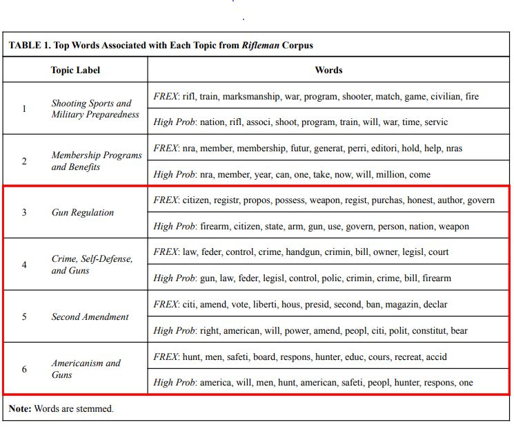
```

---

**What the topic model revealed:**
- Distinct clusters of language about opponents: politicians, media, lawyers.
- Consistent negative framing across decades.

---

### Lacombe: Words Associated with Opponents

**Politicians described as:** bureaucrat(ic), reformer(s), big city, urban, elitist, special interests, tyrannical, "F" troop.

**Media described as:** liar(s), coward(ly), elitist, phony, cynical, devious, shameless, propaganda/propagandists.

**Lawyers described as:** greedy, fat-cat, opportunist(s), big city, urban, elitist, phony, cynical, liar(s).

**General anti-American framing:** fanatic(s), extreme/extremists, radical(s), hysterical, anti-liberty, Communist(s), tyrannical, globalist.

---

### Lacombe: From Topics to Close Reading

```{r, echo=FALSE, out.width="70%"}
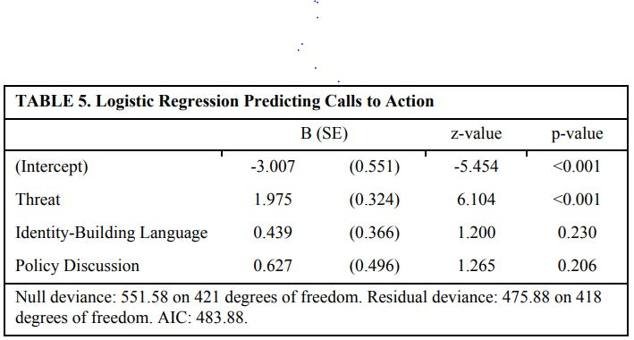
```
---

**Qualitative follow-up:**
- Close reading of letters written to Presidents Johnson and Bush in response to NRA calls to action.
- Confirmed that ordinary gun owners *adopted the NRA's language* in their own political communication.

**Integration:** Topic model identified the *words the NRA used*; qualitative reading showed how these words worked to produce the theoretically-relevant process of *identity diffusion* among gun owners.

---

### Example: Alex Jones and the Rise of the Alt-Right

**Puzzle:** What drove the growth of InfoWars and the alt-right?

**ML Approach: LASSO Regression**
- Outcome: Alex Jones mentions of a topic or Proud Boys activity.
- Predictors: Thousands of words from InfoWars transcripts.
- LASSO selects a sparse set of words that best predict the outcome.

---

### LASSO: A Brief Introduction

**OLS Regression:** Minimizes $\sum (Y - X\hat{\beta})^2$

**LASSO Regression:** Minimizes $\sum (Y - X\hat{\beta})^2 + \lambda \sum |\hat{\beta}_j|$

- The penalty $\lambda$ shrinks coefficients toward zero.
- Many coefficients become **exactly zero**.
- Result: A sparse model that highlights the **most predictive** features.

---

### Alex Jones LASSO Results

| Outcome    | Word                 | Coefficient |
|:-----------|:---------------------|:-----------:|
| Alex Jones | Pappert              | 6.70        |
| Alex Jones | Sanctimoniously      | 6.63        |
| Alex Jones | 87778925398777892539 | 4.34        |
| Alex Jones | Bolsonaro            | 4.22        |
| Proud Boys | Zionist              | 0.11        |
| Proud Boys | Loudmouth            | 0.08        |

---

**Qualitative follow-up:** Let's look into "Pappert"! 

---

```{r, echo=FALSE, out.width="70%", fig.retina = 1, fig.align='center'}
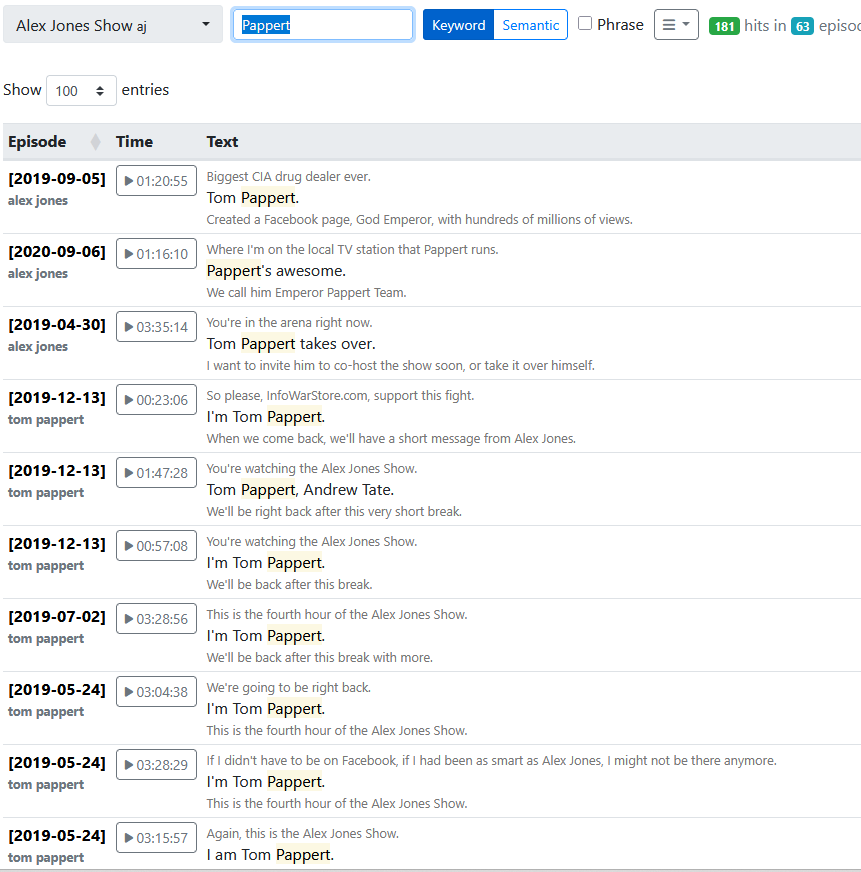
```

---

```{r, echo=FALSE, out.width="70%", fig.retina = 1, fig.align='center'}
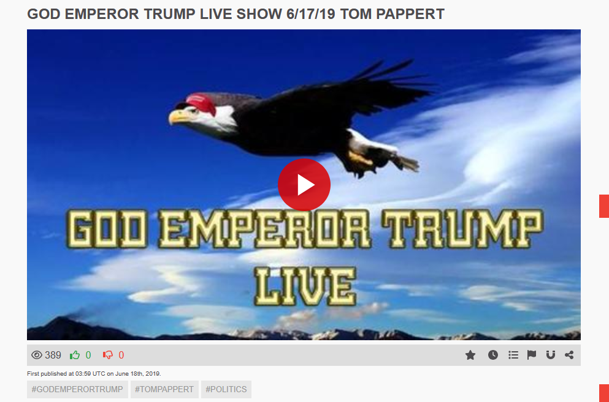
```

---

In Pappert's appearances on InfoWars, he is generally introduced with reference to this brand name. Why would this tend to drive new people to the identity?

---

We can look deeper, taking advantage of an unusual qualitative archive of Alex Jones's personal communications!

---

```{r, echo=FALSE, out.width="70%", fig.retina = 1, fig.align='center'}
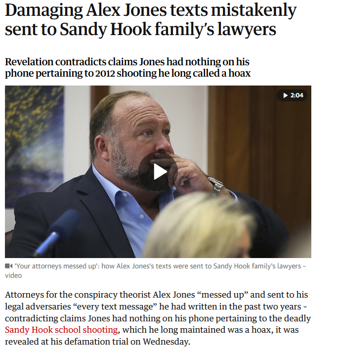
```

---

```{r, echo=FALSE, out.width="70%", fig.retina = 1, fig.align='center'}
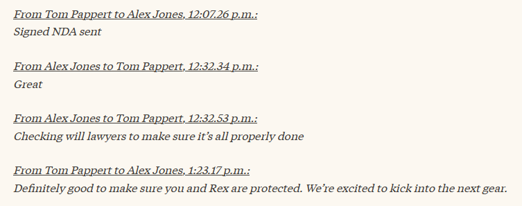
```

---

```{r, echo=FALSE, out.width="70%", fig.retina = 1, fig.align='center'}
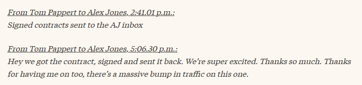
```

---

```{r, echo=FALSE, out.width="50%", fig.retina = 1, fig.align='center'}
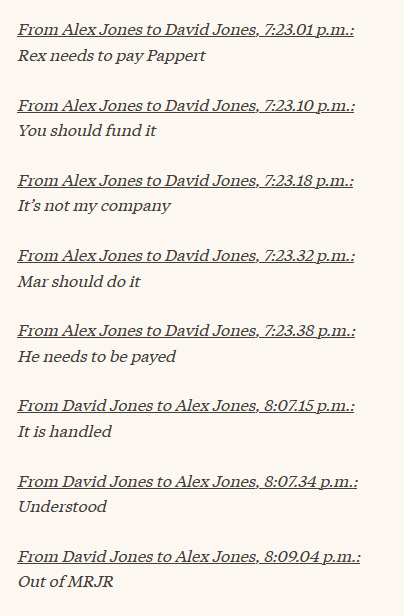
```

---

National File cross-posted InfoWars content and promoted frequent InfoWars guests, leading to searches that would generate "organic" discovery of Jones's platform.

---

Just for fun, why "Sanctimoniously"? 

---

```{r, echo=FALSE, out.width="100%", fig.retina = 1, fig.align='center'}
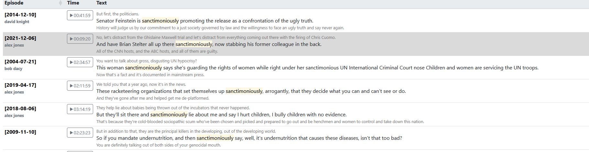
```

---

```{r, echo=FALSE, out.width="100%", fig.retina = 1, fig.align='center'}
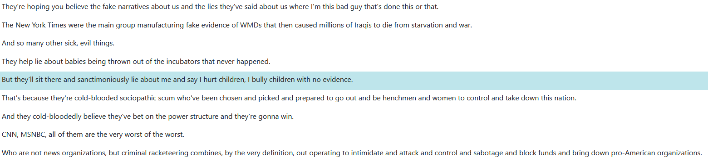
```

---

```{r, echo=FALSE, out.width="70%", fig.retina = 1, fig.align='center'}

```

---

```{r, echo=FALSE, out.width="70%", fig.retina = 1, fig.align='center'}
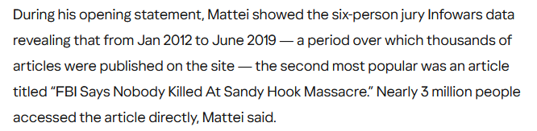
```

---

- Conflict and controversy drive interest in the far right and may motivate new audience members to check out the identity for the first time.

---

**ML as discovery tool:** The words from our statistical results are *clues* that kick off in-depth qualitative analysis.

---

### Enhancing Discovery-Based Process Tracing

**Problem:** It's easier to add new themes *before* fieldwork than *after*.

**ML Solution:**
1. Collect an inclusive dataset related to your question.
2. Use ML (LASSO, random forests, topic models) to identify predictors or themes.
3. Treat those predictors as **clues** to explore in qualitative interviews or archival work.

**Result:** You enter the field with a broader, data-informed set of hypotheses.

---

### Positioning Texts in a Collection

**Challenge:** Qualitative researchers often analyze texts from large archives. How do we know if the texts we read are *representative* or *extreme*?

**ML Solution:**
1. Run a topic model on the entire text collection.
2. Use the model to characterize the distribution of topics.
3. Select texts for close reading based on their topic membership:
   - **Representative texts:** High membership in a single dominant topic.
   - **Extreme texts:** High membership in a rare topic.
   - **Boundary texts:** Mixed membership across topics.

---

### Example: January 6th Legal Documents

- **Corpus:** ~2,700 DOJ documents related to January 6th cases.
- **Method:** Structural topic model (STM).

---

```{r, echo=FALSE, out.width="70%"}
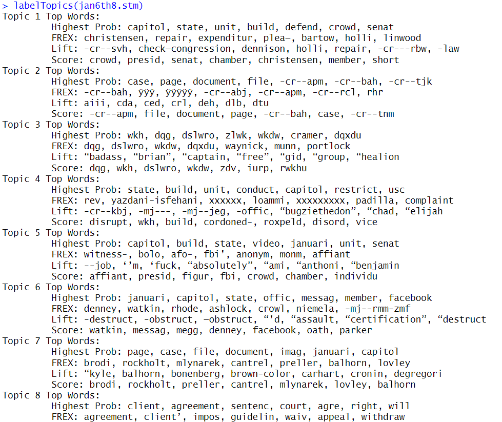
```

---

**Topics identified:**
- Topic 3 & 7: Judicial procedural documents.
- Topic 2: Plea bargains.
- Topic 5: Charge sheets.
- Topic 1: Stipulations of fact.
- Topic 4: FBI affidavits.
- Topic 6 & 8: Statements of offense (varying degrees of violence).

---

### January 6th: Topic Prevalence

| Topic                     | Average Membership |
|:--------------------------|:------------------:|
| 4 (Least Violence)        | 28%                |
| 1 (Near Violence)         | 10%                |
| 6 (Violence)              | 3%                 |
| 8 (Violence, Recruitment) | 9%                 |

**Side benefit:** The model answers a descriptive question: *How prevalent are different degrees of violence in the legal record?*

---

### January 6th: Selecting a Case for Close Reading

**Example: Joseph Howe**
- Topic model assigns him 96% membership in Topic 8 (Violence, Recruitment).
- He is a **highly exemplary case** of a relatively rare but substantively important topic.

---

```{r, echo=FALSE, out.width="50%"}
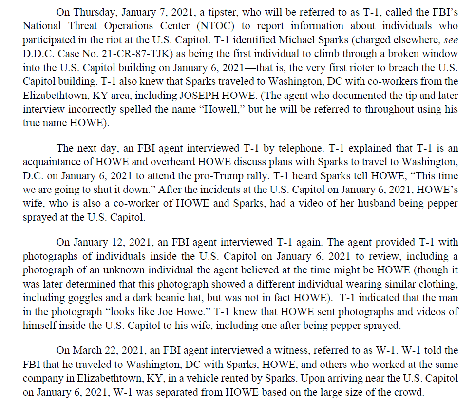
```

---

```{r, echo=FALSE, out.width="50%"}
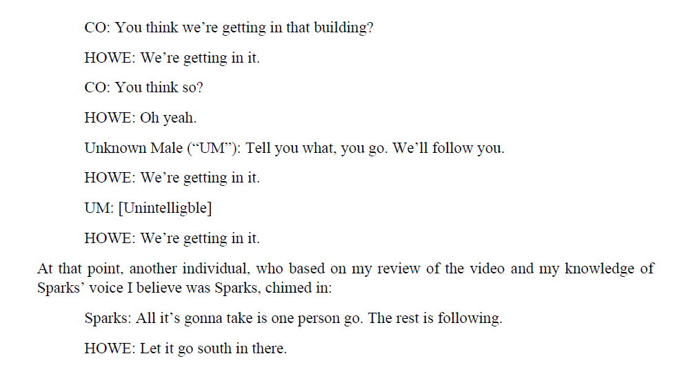
```


---

```{r, echo=FALSE, out.width="50%"}
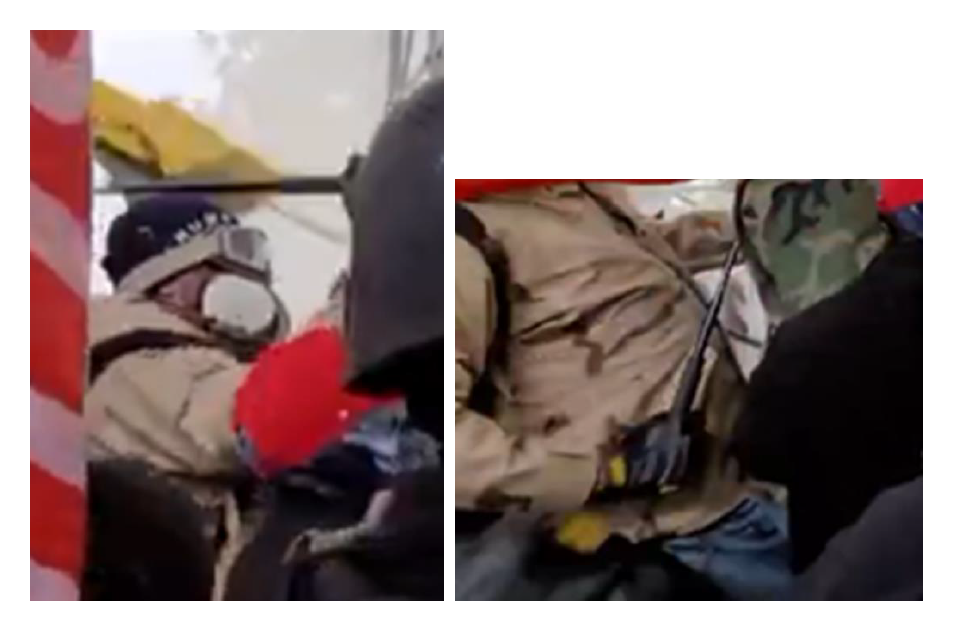
```


---

```{r, echo=FALSE, out.width="50%"}

```

---

**Qualitative reading of Howe's statement of facts reveals:**
- He brought weapons to the Capitol.
- He encouraged others to enter the building.
- He expressed intent to "stop the steal."

---

**Integration:** Topic model located a *prototypical* violent participant; close reading confirmed and elaborated the nature of his involvement.

---

### Summary: ML for Process Tracing and Case Selection

| ML Tool | Multi-Method Purpose |
|:--------|:---------------------|
| Topic Models | Identify discursive themes; select representative/extreme texts for close reading |
| LASSO | Discover unexpected predictors for qualitative follow-up |
| Random Forests | Explore complex interactions; identify important variables for case selection |
| CART | Generate hypotheses about combinations of conditions |

---

**Key Insight:** ML does not *replace* qualitative interpretation. It **structures the archive** so that qualitative effort is spent on the most informative texts.

---

class: center, middle

# Block 2: Multi-Method Designs for Concepts, Measurement, and Theory-Building

---

### Non-Causal Goals: Concept Formation

**Recall from Day 1:** The Bowman et al. critique showed that measurement error in democracy indices stems from poor conceptualization and inadequate data.

**Can ML help with concept formation?**

Yes. ML can analyze *how scholars actually use a concept* across thousands of texts, revealing latent dimensions of meaning.

---
### What Makes a Good Concept?

In the Sartori tradition, we want to:

-   Choose usages that preserve the meanings of neighboring concepts

-   Respect common and scholarly meanings for the terms in question

-   Capture well-established core defining attributes

-   Make sure that prototypical cases are sorted appropriately


---

### Example: The Concept of "Extremism"

- Over 2,000 articles in Political Science and Sociology since 1990 use "extremism" or "extremists."
- What does the term actually mean in practice?

---

### Extremism Analysis: Data Preparation

```{r, echo=FALSE, out.width="70%"}
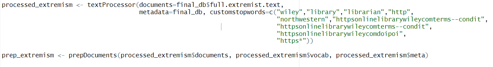
```
---

- Scrape abstracts from journals.
- Create document-term matrix.
- Run structural topic model to identify latent dimensions.

---

### Extremism Topics

```{r, echo=FALSE, out.width="80%"}
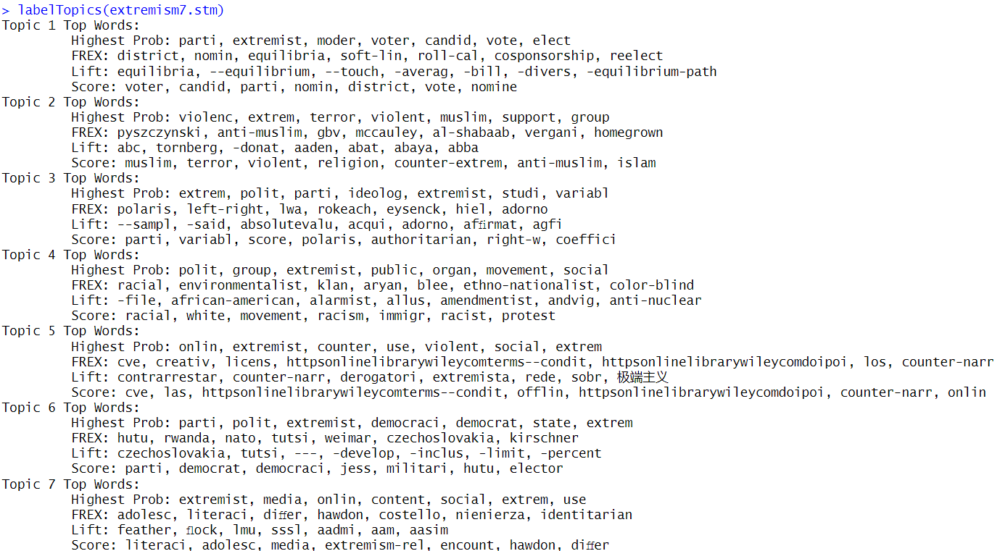
```

---

**Some very different dimensions of extremism usage:**
1. **Religious extremism:** Islamist, jihadist, fundamentalist.
2. **Right-wing extremism:** Nationalist, xenophobic, populist.
3. **Left-wing/Activist extremism:** Radical, militant, anarchist.
4. **State extremism:** Authoritarian, repressive, totalitarian.
5. **Behavioral extremism**: Terrorism, anti-state action.
6. **Spatial ideological extremism**: Positions far from the median voter.

---

### What Analysis Reveals About "Extremism"

- Scholars use "extremism" to refer to **very different phenomena**.
- The term is not unidimensional; it has distinct clusters of meaning.
- Any quantitative index of "extremism" that lumps these together is likely measuring apples and oranges.

---

**Research Design Implications:** Before constructing a measure, use ML to map the **semantic field** of the concept. Then use qualitative case studies of prototypical examples from each dimension to explore whether people actually use these meanings and how.

---

### Multi-Method Conceptualization Workflow

1. **ML Step:** Factor analysis, topic modeling, or word embeddings on a corpus of relevant texts.
2. **Qualitative Step:** Close reading of highly prototypical texts for each identified dimension. Focus groups/in-depth interviews with communities that use different conceptualizations.
3. **Integration:** Decide whether to:
   - Treat dimensions as separate concepts (disaggregate).
   - Develop a higher-order definition that encompasses all dimensions.
   - Acknowledge contested usage and define the concept narrowly for your study.

---

## What Is Factor Analysis?

**Goal:** Reduce many survey items to a smaller number of unobserved ("latent") dimensions.

**Intuition:** If respondents answer several questions similarly, those questions likely tap the same underlying attitude.

---
## Our Running Example

```{r, echo = TRUE, out.width="50%", fig.retina = 1, fig.align='center'}
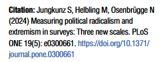
```

---

.pull-left[
**Example items for "general extremism":**
- "It is better for government leaders to make decisions without consulting anyone."
- "Under some circumstances, a nondemocratic government can be preferable."
- "The government should close communication media that are critical."
]

.pull-right[
**Factor analysis finds:**
- These items *load* onto a single factor.
- That factor represents "anti-democratic attitudes."
]

---

## How Factor Analysis Works

1. **Input:** A correlation matrix of all survey items.
2. **Extraction:** Find linear combinations (factors) that explain shared variance.
3. **Rotation:** Make factors interpretable (e.g., each item loads highly on one factor, low on others).
4. **Result:** Factor loadings—the correlation between each item and the latent factor.

---

```{r, eval=FALSE, echo=TRUE}
# Conceptual R code (not run)
library(psych)
fa_results <- fa(survey_items, nfactors = 3, rotate = "oblimin")
print(fa_results$loadings, cutoff = 0.3)
```


---

## Visualizing Factor Analysis: The Measurement Model

**Observed variables (survey items) are caused by unobserved latent factors.**

---

```{r, eval=TRUE, echo=FALSE}
library(lavaan)
library(semPlot)

# Define the measurement model
model <- '
  LWR =~ LWR1 + LWR2 + LWR3 + LWR4 + LWR5 + LWR6
  RWR =~ RWR1 + RWR2 + RWR3 + RWR4 + RWR5 + RWR6 + RWR7 + RWR8
  GEX =~ GEX1 + GEX2 + GEX3 + GEX4 + GEX5
'

# Create a simple diagram
semPaths(
  semPlotModel_lavaanModel(model),
  what = "path",
  whatLabels = "none",
  style = "lisrel",
  layout = "tree",
  rotation = 2,
  sizeMan = 4,
  sizeLat = 8,
  curve = 0.5,
  nCharNodes = 0,
  nCharEdges = 0,
  edge.color = "black",
  nodeLabels = c(
    "LWR1", "LWR2", "LWR3", "LWR4", "LWR5", "LWR6",
    "RWR1", "RWR2", "RWR3", "RWR4", "RWR5", "RWR6", "RWR7", "RWR8",
    "GEX1", "GEX2", "GEX3", "GEX4", "GEX5",
    "Left-Wing\nRadicalism", "Right-Wing\nRadicalism", "General\nExtremism"
  )
)
```
---

## Jungkunz et al.: Three Scales

| Scale | Example Items |
|:------|:--------------|
| **Left-Wing Radicalism (LWR)** | "Capitalism is ruining the world." "National states should be abolished." |
| **Right-Wing Radicalism (RWR)** | "We should have the courage to have a strong sense of national consciousness." "Foreigners and asylum seekers are the ruin of [country]." |
| **General Extremism (GEX)** | "Under some circumstances, a nondemocratic government can be preferable." "A concentration of power in one person guarantees order." |

---

**Key insight:** Anti-democratic attitudes (GEX) are *distinct* from left- or right-wing radicalism. An extremist holds **both** radical and anti-democratic views.

---

## Measurement Invariance: Can We Compare Across Countries?

**Problem:** If the scale means different things in different countries, comparing scores is invalid.


---

**Jungkunz et al. test three levels of invariance:**

| Level | What is constrained equal? | What can we compare? |
|:------|:---------------------------|:---------------------|
| **Configural** | Same factor *structure* (items load on same factors) | Nothing yet—just confirms the basic pattern exists |
| **Metric** | Factor *loadings* are equal | Regression coefficients, correlations with predictors |
| **Scalar** | Factor loadings *and* item intercepts are equal | Latent means (e.g., "Germans are more extremist than Dutch") |

---

## Invariance Results in Jungkunz et al.

**Metric invariance claimed for all three scales.**
- We can compare *relationships* between extremism and predictors across countries.
- Example: The correlation between conspiracy beliefs and extremism is comparable in Germany, UK, and Netherlands.

---

**Scalar invariance claimed only after relaxing some constraints (partial scalar).**
- We can cautiously compare *levels* of extremism across countries.
- Finding: ~2-4% of population holds extremist attitudes in all three countries.

---

**Quantitative test:** Changes in RMSEA and CFI between constrained models.

```{r, echo=FALSE, out.width="80%", fig.retina = 1, fig.align='center'}
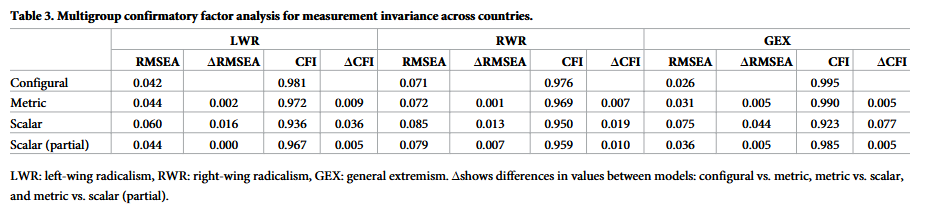
```

---

## The Substantive Meaning of Invariance Assumptions

**Metric invariance assumes:**
> A one-unit increase in the latent construct (e.g., right-wing radicalism) corresponds to the *same* change in item responses across countries.

**Scalar invariance assumes:**
> Respondents with the *same* latent extremism score give the *same* average response to each item, regardless of country.

---

## Quantitative Invariance Tests

- **RMSEA (Root Mean Square Error of Approximation):** Measures how *badly* the model fits the data *per degree of freedom*. Lower is better.
- **CFI (Comparative Fit Index):** Measures how much *better* the model fits compared to a null model (no relationships). Higher is better.

---

**For Measurement Invariance Testing (Chen 2007):**

- Every test compares a null hypothesis of invariance being true against the alternative hypothesis that it fails.
- **Metric invariance fails** if $\Delta \text{CFI} \leq -0.01$ or $\Delta \text{RMSEA} \geq 0.015$ compared to configural model.
- **Scalar invariance fails** if the same thresholds are exceeded compared to metric model.

---

**Intuition:** These indices tell us whether imposing cross-country equality constraints *meaningfully worsens* model fit. If not, there isn't enough evidence to be sure that cross-country comparison is invalid.

- Even if the tests are passed, there still isn't positive, affirmative evidence *in favor of* invariance. We would need some other form of evidence for that.

---

**Why might invariance substantively fail?**
- **Cultural differences in interpretation:** "National consciousness" may mean different things in Germany (post-war identity) vs. UK (imperial nostalgia).
- **Social desirability bias:** Admitting anti-democratic views may be more taboo in Germany than in the Netherlands.
- **Translation issues:** "Foreigners are the ruin of [country]" may carry different weight depending on immigration history.

---

## A Multi-Method Approach: Focus Groups to Test Invariance

**Quantitative invariance tests tell us *if* assumptions hold, but not *why* they fail when they do.**

**Qualitative focus groups can:**
1. Probe how respondents *interpret* survey items.
2. Reveal whether similar responses mask different underlying meanings.
3. Uncover cultural or political factors that shift response thresholds.

---

**Design for Jungkunz et al.:**
- Conduct focus groups in each country (Germany, UK, Netherlands).
- Participants discuss key items from the extremism survey together as a group.
- Moderator asks: *"What did you think this question meant? Can you give an example of what a 'nondemocratic government' looks like?"*
- Compare interpretations across countries.

---

## Focus Group Protocol (Example)

**Participants:** 6-8 adults per country, stratified by education and political interest.

**Procedure:**
1. **Individual survey:** Complete the full extremism battery.

---

2\. **Group discussion of selected items:**
   - *"Under some circumstances, a nondemocratic government can be preferable."*
     - What circumstances came to mind?
     - Is this a statement you would feel comfortable agreeing with publicly? Why or why not?
   - *"We should have the courage to have a strong sense of national consciousness."*
     - What does "national consciousness" mean to you?
     - Does this phrase have positive, negative, or mixed connotations in your country?
3\. **Debrief:** How did others' comments change your understanding of the questions?

---

## What Focus Groups Might Reveal

| Item | Potential Cross-National Difference |
|:-----|:-----------------------------------|
| "Nondemocratic government can be preferable" | Germans may reference Nazi history and reject strongly; Britons may think of efficient technocracy. |
| "Strong sense of national consciousness" | In Germany, may evoke Nazi-era nationalism (taboo); in UK, may evoke Brexit-era patriotism (acceptable). |
| "Government should close critical media" | In Netherlands (strong free press tradition), strong rejection; in other contexts, may be seen as protecting public order. |

---

**Implication for invariance:**
- If Germans and Britons with the *same* latent extremism score answer differently because of these cultural frames, scalar invariance fails.
- The quantitative test flags the problem; the focus groups *explain* it.

---

## Integrating Qualitative Findings into Scale Refinement

**If focus groups reveal systematic differences in interpretation:**
1. **Revise item wording** for cross-national equivalence.
2. **Drop items** that are culturally specific and cannot be salvaged.
3. **Develop anchoring vignettes** to calibrate responses across countries.

---

**Multi-method contribution:**
- Quantitative factor analysis provides the *structure*.
- Qualitative focus groups provide the *meaning*.
- Together, they produce scales that are both statistically valid and substantively interpretable across contexts.

---

### Theory-Building: CART for Discovering Complex Causation

**CART (Classification and Regression Trees):**
- Predicts an outcome based on a set of predictors.
- No assumptions of linearity or additivity.
- Produces an interpretable tree structure.

**Use in multi-method research:** CART suggests **combinations of conditions** that lead to an outcome. These combinations are hypotheses for process tracing.

---

### CART Example: Really Getting Everything Out of an Experiment

```{r, echo=FALSE, out.width="60%"}
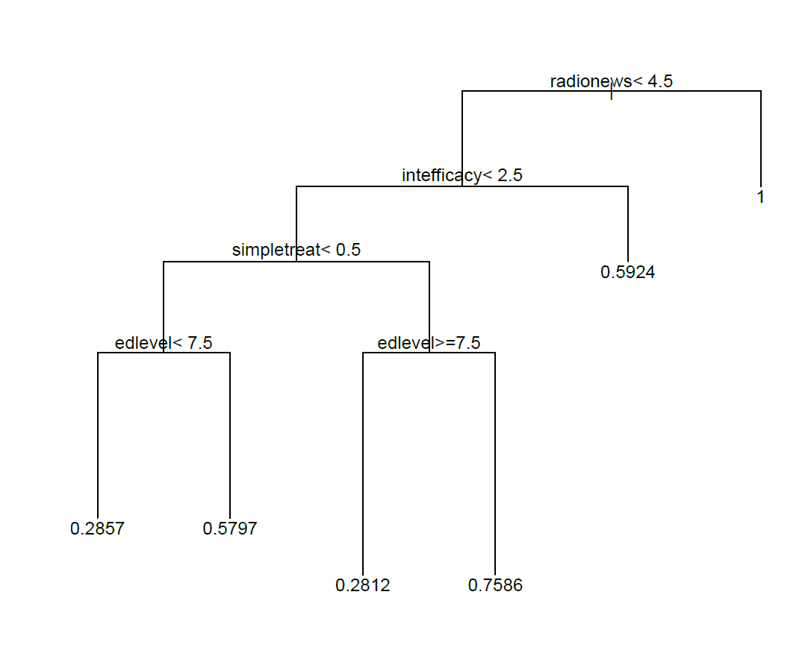
```

---

**Hypothesis from the tree:** Populist political communication or high internal efficacy or low education plus anger $\rightarrow$ outsider voting (in the Peruvian context).

**Qualitative follow-ups:** Select cases that follow one or more of the interesting paths and learn what you can!

---

### Simulation: CART vs. QCA with Omitted Variables

**Data-generating process:**
$$Y = X_1 X_9 + X_2 X_3 X_4 X_9 + X_3 X_5 X_{10}$$
where $X_9$ and $X_{10}$ are **unobserved**.

| Method | No Omitted Variables | Omitted Variables |
|:-------|:--------------------:|:-----------------:|
| QCA    | Recovers true model  | Fails badly        |
| CART   | Approximates well    | Still performs reasonably |

---

**Implication:** ML methods like CART and random forests are **more robust** to omitted variable bias than deterministic set-theoretic methods. This makes them safer tools for discovery-oriented research.

---
```{r, echo = TRUE, out.width="90%", fig.retina = 1, fig.align='center'}
library(rpart)
qog_std_ts_jan22 <- read.csv("data/qog_std_ts_jan22.csv")
```

---
```{r, echo = TRUE, out.width="40%", fig.retina = 1, fig.align='center'}
dem.cart <- rpart(vdem_libdem ~ vdem_gender + vdem_corr + wdi_gdpcapcon2010 + wdi_mobile + wdi_gerp + une_surlgpef + wdi_fertility, data=qog_std_ts_jan22, na.action=na.omit)

plot(dem.cart)
text(dem.cart, use.n=TRUE)
```

---
### More current tools than CART for Multi-Method Research

---
### Random Forests

1.  Bootstrap the underlying data.

2.  Run CART, selecting a random subset of datapoints and variables at each
    decision node.

3.  Repeat several times, and find a way to average the results
    together.

---
```{r, echo = TRUE, out.width="90%", fig.retina = 1, fig.align='center'}
library(randomForest)
```

---
```{r, echo = TRUE, out.width="90%", fig.retina = 1, fig.align='center'}
dem.rf <- randomForest(vdem_libdem ~ wdi_gendeqr + bci_bci + wdi_gdpcapcon2010 + wdi_mobile + wdi_gerp + une_surlgpef + wdi_fertility, data=qog_std_ts_jan22, na.action=na.omit,
                       localImp=TRUE)

dem.rf
```

---
```{r, echo = TRUE, out.width="70%", fig.retina = 1, fig.align='center'}
library(randomForestExplainer)
```

---
```{r, echo = TRUE, out.width="50%", fig.retina = 1, fig.align='center'}
dem.mindepth <- min_depth_distribution(dem.rf)
plot_min_depth_distribution(dem.mindepth)
```

---
```{r, echo = TRUE, out.width="60%", fig.retina = 1, fig.align='center'}
plot_min_depth_interactions(dem.rf)
```


---

### LASSO for Control Variable Selection

**Problem from Module 1:** How do we choose control variables when we have dozens (or hundreds) of candidates?

**Double-Selection LASSO (Belloni et al.):**
1. Run LASSO predicting $Y$ from all potential controls.
2. Run LASSO predicting $X$ from all potential controls.
3. Keep variables selected in **either** regression.

**Advantage:** Data-driven control selection that avoids $p$-hacking and reduces researcher degrees of freedom.

**Caveat:** Still requires theoretical knowledge to avoid post-treatment variables.

---

### Outcome-Adaptive LASSO

**Problem with Double-Selection:** It may include *instruments* (variables that affect $X$ but not $Y$ directly) as controls, which can increase variance without reducing bias.

**Outcome-Adaptive LASSO (Shortreed & Ertefaie):**
- Penalizes variables more heavily if they are strongly associated with $X$ but weakly associated with $Y$.
- Prioritizes confounders over instruments.

**Multi-Method Implication:** Use ML to **propose** control variables; use qualitative knowledge to **veto** post-treatment or substantively inappropriate controls.

---

### Summary: ML for Non-Causal Goals

| Goal | ML Tool | Qualitative Follow-Up |
|:-----|:--------|:---------------------|
| Concept formation | Factor analysis, topic models | Close reading of prototypical texts |
| Measurement validation | Clustering, dimensionality reduction | Cognitive interviews, expert review |
| Theory discovery | CART, random forests | Process tracing of generated hypotheses |
| Control variable selection | LASSO, adaptive LASSO | Qualitative vetting for post-treatment bias |

---

class: center, middle

# Block 3: Hands-On Lab: Machine Learning and Qualitative Evidence for Discovery

---

### Lab Objectives

1. Use CART to discover combinations of conditions associated with an outcome.
2. Identify cases along a path through the tree for qualitative follow-up.
3. Use internet research to evaluate whether the variables on the path are plausible causal factors.
4. Complete an online exercise applying process tracing to elite messaging on climate change.

---

### Part 1: CART for Discovering Theory

**Dataset:** King and Zeng's state collapse data (1000+ variables, country-years).

**Outcome:** Homicide rate (`homratet`).

**Task:** Fit a CART model and explore the tree.

```{r, eval=FALSE, echo=TRUE}
# Load packages
library(rpart)

# Load data
kingzeng <- read.csv("data/kingzeng.csv")

# Fit CART with a subset of predictors
homicide.cart <- rpart(homratet ~ bnkv10 + bnkv125 + bnkv34 + faocalry + gdf_gnp, 
                       data = kingzeng)

# Visualize
plot(homicide.cart)
text(homicide.cart, use.n = TRUE)
```

---

### Part 1 (Continued): Interpret the Tree

**Discussion Questions:**
1. What is the first split? What does it suggest about the most important predictor of homicide rates?
2. Follow one path from root to leaf. What combination of conditions leads to high homicide rates? Low homicide rates?
3. Identify a country-year that falls on a theoretically interesting path.

---

### Part 2: Qualitative Follow-Up

**Task:**
1. Select one path through the tree that you find substantively intriguing.
2. Identify a specific case (country-year) that falls on that path.
3. Using internet research (Wikipedia, news archives, academic articles), investigate whether the variables on the path are plausibly *causal* or merely *correlational*.

**Guiding Questions:**
- Is there evidence that the predictor actually causes the outcome in this case?
- Are there alternative explanations (confounders) that the tree doesn't capture?
- Would you revise the model based on what you find?

---

### Part 3: Process Tracing Elite Messages on Climate Change

**Online Exercise:**
Navigate to: `https://jnseawright.github.io/practice-of-multimethod/Chapter-3.html#Process-tracing_elite_messaging_on_climate_change`

**Task:**
- Read the description of the elite messaging study.
- Identify the causal process observations (CPOs) that would confirm or disconfirm the hypothesis.
- Design a process-tracing test (hoop test, smoking gun, etc.) for the hypothesis.

**Deliverable:** A short memo describing:
1. The hypothesis and its alternatives.
2. The evidence you would seek.
3. The inferential logic (Bayesian or informal) connecting evidence to conclusions.

---

### Part 4 (Time Permitting): Topic Model Exploration

**Alternative Lab Activity:**
If students have already completed the CART exercise, they can explore the January 6th topic model results (provided as pre-computed topic assignments).

**Task:**
- Examine the topic descriptions.
- Select one document from a topic of interest.
- Read the original DOJ document (links provided).
- Discuss: How does the topic model's characterization compare to your close reading?
 research, exactly as described in the course description.