class: center, middle

```{css, echo=FALSE}
pre {
  max-height: 400px;
  overflow-y: auto;
}
pre[class] {
  max-height: 200px;
}
```

```{r setup, include=FALSE}
knitr::opts_chunk$set(echo = FALSE, warning = FALSE, message = FALSE)
library(knitr)
library(ggplot2)
library(dplyr)
library(ggdag)
```

```{r xaringan-themer, include=FALSE}
library(xaringanthemer)
style_mono_accent(
  base_color = "#1c5253",
  header_font_google = google_font("Josefin Sans"),
  text_font_google   = google_font("Montserrat", "300", "300i"),
  code_font_google   = google_font("Fira Mono"),
  text_font_size = "1.6rem"
)
```

---

## Block 1: Why Integrate? Roles of Qualitative Work

---

### Why Mixed-Method Research?

```{r, out.width="50%", fig.align='center'}
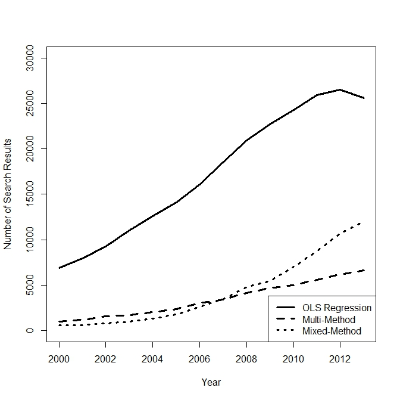
```

In 2024:
- 7,690 instances of "OLS regression"
- 1,470 instances of "multi-method"
- 29,500 instances of "mixed-method"

---
### Lieberman's Paradigm

```{r, echo = FALSE, out.width="50%", fig.retina = 1, fig.align='center'}
include_graphics("liebermanarticle1.png")
```

---

```{r, echo = FALSE, out.width="50%", fig.retina = 1, fig.align='center'}
include_graphics("liebermanbook1.png")
```

---

```{r, echo = FALSE, out.width="50%", fig.retina = 1, fig.align='center'}
include_graphics("liebermanbook2.png")
```

---

```{r, echo = FALSE, out.width="50%", fig.retina = 1, fig.align='center'}
include_graphics("liebermanbook3.png")
```

---
### A Newer Example

Why do some states in the U.S. have many fewer laws about labor than
other states?


---
### Galvin and Seawright (2023)

Probably it has something to do with unions?


---

```{r, echo = FALSE, out.width="50%", fig.retina = 1, fig.align='center'}
include_graphics("galvin1.jpg")
```

---

```{r, echo = FALSE, out.width="50%", fig.retina = 1, fig.align='center'}
include_graphics("galvin2.jpg")
```

---

```{r, echo = FALSE, out.width="50%", fig.retina = 1, fig.align='center'}
include_graphics("galvin3.jpg")
```


---

```{r, echo = FALSE, out.width="50%", fig.retina = 1, fig.align='center'}
include_graphics("galvin4.jpg")
```

---

```{r, echo = FALSE, out.width="50%", fig.retina = 1, fig.align='center'}
include_graphics("galvin5.jpg")
```


---

```{r, echo = FALSE, out.width="50%", fig.retina = 1, fig.align='center'}
include_graphics("galvin6.jpg")
```


---

```{r, echo = FALSE, out.width="50%", fig.retina = 1, fig.align='center'}
include_graphics("galvin7.jpg")
```


---

```{r, echo = FALSE, out.width="50%", fig.retina = 1, fig.align='center'}
include_graphics("galvin8.jpg")
```

---

```{r, echo = FALSE, out.width="50%", fig.retina = 1, fig.align='center'}
include_graphics("galvin9.jpg")
```

---

```{r, echo = FALSE, out.width="50%", fig.retina = 1, fig.align='center'}
include_graphics("galvin10.jpg")
```

---

```{r, echo = FALSE, out.width="50%", fig.retina = 1, fig.align='center'}
include_graphics("galvin11.jpg")
```

---

```{r, echo = FALSE, out.width="50%", fig.retina = 1, fig.align='center'}
include_graphics("galvin12.jpg")
```

---
### A Different Kind of Example

Laitin and Fearon (2003) report statistical evidence of a connection
between mountainous terrain and civil war.


---
### A Different Kind of Example

Logit coefficients for the relationship range between 0.12 and 0.42.


---
### A Different Kind of Example

```{r, echo = FALSE, out.width="50%", fig.retina = 1, fig.align='center'}
include_graphics("colombiamountains.jpg")
```


---
### A Different Kind of Example

Colombia experienced civil war through much of the 19th century


---
### A Different Kind of Example

```{r, echo = FALSE, out.width="50%", fig.retina = 1, fig.align='center'}
include_graphics("laviolencia.jpg")
```

---
### A Different Kind of Example

```{r, echo = FALSE, out.width="50%", fig.retina = 1, fig.align='center'}
include_graphics("colombiafarc.jpg")
```

---
### A Different Kind of Example

```{r, echo = FALSE, out.width="50%", fig.retina = 1, fig.align='center'}
include_graphics("columbia_farc_02.jpg")
```

---
### A Different Kind of Example

```{r, echo = FALSE, out.width="50%", fig.retina = 1, fig.align='center'}
include_graphics("bogota.jpg")
```

---

### What Is Multi-Method Research?

**Triangulation**  
Combination of research designs from more than one methodological family, each aimed at providing *separate* answers to a research question.

**Integrative Multi-Method Research**  
Techniques drawn from more than one methodological family used in the course of answering a *single integrated* research question or testing a *single overarching* hypothesis.

---

### The Paradigmatic Case: Snow on Cholera (1855)

- John Snow correctly identified cholera's mode of transmission.
- **Quantitative component:** Data on mortality rates by water company.
- **Qualitative component:** Interviews with residents to determine knowledge of water source, etc., case histories.

---
### Agenda

1.  Integration and the potential outcomes framework

2.  Causal inference and regression

3.  How qualitative research contributes to causal inference

4.  Case selection

5.  Assumption-testing research designs for regression/case studies


---
### Agenda

6.  Qualitative methods and experiments

7.  Qualitative methods and natural experiments

8.  Machine learning and qualitative causal inference

9.  Machine learning, qualitative methods, and other goals

---
### A Spectrum of Arguments about Multiple Methods

-   Social-science methods never teach us anything

-   One family of research is always better than the others

-   Quantitative and qualitative research can never communicate

-   Triangulation

-   Integration


---
### Goertz and Mahoney

Qualitative and quantitative research speak different languages because
of differences in ontology.


---
### Concepts of Causation

Potential Outcomes Framework

$T_{i}$, $Y_{i,t}$


---
### Concepts of Causation

Necessary Causation

$Y_{i,0} = 0$ for all $i$.


---
### Concepts of Causation

Sufficient Causation

$Y_{i,1} = 1$ for all $i$.


---
### Concepts of Causation

Causal Pathways

$T_{i}$

$M_{i,t,1}$, $M_{i,t,m1,2}$, $M_{i,t,m1,m2,3}$, etc

$Y_{i,t,m1,m2,m3}$


---
### Four Traditions of Causal Thought

Humean Regularity Theory

Counterfactual Theory

Manipulation Theory

Capacities and Mechanisms


---
### Regularity Theory

Finding stable, predictive patterns is the goal of causal inference in this tradition.

-   One might think of econometrics, time-series analysis, and data science as paradigms here.

-   But, on the qualitative side, comparative method, set theory, and QCA strategies fit, as well.

---
### Counterfactuals

Analyzing causation involves figuring out what would have happened had the cause actually (not) happened in a given case.

-   One might think paradigmatically of qualitative research (e.g., Harvey 2012).

-   Counterfactual thinking is central to how quantitative researchers think about difference-in-differences, regression-discontinuity designs, the range of cases for which a regression is valid, etc.


---
### Manipulation

Manipulationist theories of causation argue that doing a change to an independent variable is the only real way to see its causal effect on a dependent variable.

-   One might think paradigmatically of social-science experiments.

-   Thinking about manipulations also helps define plausible and implausible counterfactuals in quantitative observational studies.

-   Similar ideas in qualitative thinking are framed as "agency" and "process causality."

---
### Capacities and Mechanisms

The idea here is that the world consists of collections of entities with certain innate traits and abilities ("capacities") arranged in certain ways ("mechanisms") that bring about the outcomes or events of interest. Causes and effects are not generic constants or distributions; they are contingent products of interactions within systems.

---
### Capacities and Mechanisms

-   Quantitative research may capture some aspect of this through effect heterogeneity.

-   Better is to study pathways and directly analyze differences.

-   Qualitative researchers may be interested in directly describing arrangements of capacities as part of a research strategy.

---
### Florida, 2000

-   Brady (2004)


---
### Florida, 2000

-   John Lott (2000) uses regression to estimate that early media calls
    in the Florida panhandle cost George W. Bush at least 10,000 votes.


---
### Florida, 2000

$303,000 * \frac{1}{72} \approx 4,200$

-   Census data from 1996 suggest that about 1/12 of voters go to the
    polls during the last hour.

-   The call was made with 10 minutes to go, so perhaps 1/72 of voters
    who would have voted had not yet arrived at the polls.


---
### Florida, 2000

$303,000 * \frac{1}{72} * \frac{1}{5} \approx 840$

-   Research on media exposure suggests that 20% or fewer of people in
    the panhandle would have heard the media call during the 10 minutes
    before the polls closed.


---
### Florida, 2000

$303,000 * \frac{1}{72} * \frac{1}{5} * \frac{2}{3} \approx 560$

-   Bush was supported by about 2/3 of panhandle voters.


---
### Florida, 2000

$303,000 * \frac{1}{72} * \frac{1}{5} * \frac{2}{3} * \frac{1}{10} \approx 56$

-   Prior quantitative research suggests that about 10% of intended
    voters who hear an early call before they arrive at the polls may be
    dissuaded from voting.


---
### Rights and Liberties

-   Survey research on tolerance, civil liberties, individual rights

-   In-depth analysis of 30 think-aloud transcripts from a survey
    pretest


---
### Rights and Liberties

-   Do citizens anchor their opinions to what they understand of current
    law?


---
### Rights and Liberties

Q. Do you think that a person who is caught red-handed deserves a full
blown trial?

A. Yeah, I think that's one of our rights. I think that's in the Bill of
Rights that, uhh, you have the right to a trial. Uhh how, what defense
the attorney would take I don't know. I mean it --- but again it's a
matter of making the punishment fit the crime which I think a trial,
that's one purpose of a trial. I mean I don't think a man that's
stealing a loaf of bread should be executed. And I think a trial would
bring out, uh, how serious the crime was and maybe there were some
mitigating circumstances. And I think all that's part of a trial. So I
think anyone deserves a trial.


---
### Rights and Liberties

Q. What if the police stop someone for weaving dangerously in traffic.
Do they have the right to search the glove compartment or trunk of the
car if they suspect that he's on drugs?

A. I think the courts have said that they haven't, isn't that what they
courts have said? Well, you hear verdicts where it's on and off but it,
it seems to me that they, they probably shouldn't.


---

class: center, middle

# Block 2: Building Cases into Regression Designs

---

### The Challenge: Which Cases to Study In-Depth?

- We cannot conduct in-depth case studies of all 150+ countries (or 50 U.S. states, or 10,000 individuals).
- Case selection must be **deliberate** and **helpful**.
- Goal: Ensure **maximum probability of meaningful discoveries** when moving from large-N to small-n.

---

### Typical Cases

**Definition:** Cases that lie close to the regression line.

`$$\text{Typicality}_{i} = - \left| y_{i} - \hat{y}_{i} \right|$$`

- Useful for: Demonstrating the central causal pathway under *average* conditions.
- If the mechanism works here, it likely works generally.

---

```{r, out.width="70%", fig.align='center'}
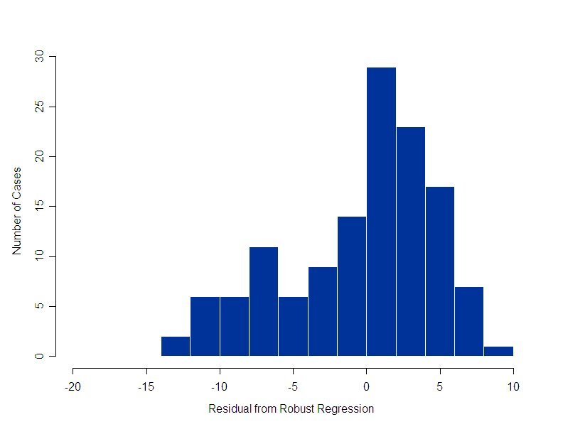
```

---

### Deviant Cases (Outliers)

**Definition:** Cases with large residuals (poorly predicted by the model).

`$$\text{Deviantness}_{i} = \left| y_{i} - \hat{y}_{i} \right|$$`

- Useful for:
  - Discovering **weak omitted variables**
  - Testing for **measurement error** in the dependent variable
  - Exploring **causal pathways** where the causal effect is unusually large
  - Identifying *scope conditions* of the theory

---

### Extreme Cases on $X$

**Definition:** Cases far from the mean on the independent variable of interest.

`$$\text{Extremity}_{i} = \left| \frac{x_{i} - \bar{x}}{s} \right|$$`

- Useful for:
  - Testing **measurement error** in the independent variable
  - Discovering **confounders**
  - Exploring causal pathways where the treatment is *strongest*
  - Verifying that the relationship holds at the extremes

---

### Influential Cases

**Definition:** Cases whose inclusion substantially changes the regression estimate.

**Cook's Distance:** A statistical measure of how much the overall regression result changes if a given case is deleted.

- Cook's D $\ge 1$ indicates substantial influence.
- Useful for:
  - Checking **robustness** of findings
  - Identifying cases that "drive" the results

---

```{r, out.width="70%", fig.align='center'}
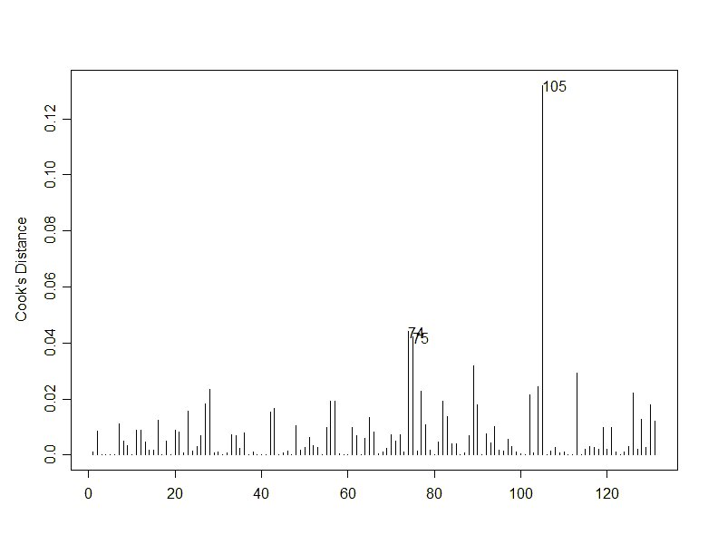
```

---

### Summary: Case Selection and Assumptions

| Case Type | Best for Testing |
| :--- | :--- |
| Typical | Nothing, really |
| Deviant | Weak omitted variables, measurement error in $Y$, Causal pathways |
| Extreme on $X$ | Measurement error in $X$, Causal pathways |
| Influential | Robustness, I guess? |

**Key Insight:** The choice of case depends on *which assumption* you are most worried about, but most goals can be met with either deviant cases or extreme cases on $X$.

---
### Propensity-Adjusted Extreme Cases

We've discussed typical, deviant, extreme, and influential cases.

But there's a problem...

---

## The Problem with Unadjusted $X$

Cases extreme on $X$ may also be extreme on *all* the control variables.

- **Overdetermination:** Everything pushes in the same direction.
- **Messy process tracing:** Hard to isolate the pathway of interest.
- **Inert case selection:** Once you pick them, they never change—even after you learn about new confounders.

Can we do better?

---

## Introducing "Surprising Causes"

**Galvin and Seawright (2023)** propose:

> Select extreme cases on the **propensity-adjusted** version of the treatment variable.

Intuition:
- Cases where the value of $X$ is **as surprising as possible** given the control variables.
- Cases where $X$ is unusually high *despite* controls suggesting it should be low (or vice versa).

---

## Formal Definition: Propensity-Adjusted $X$

1. Regress the treatment variable $X$ on all measured confounders $\mathbf{Z}$:
   $$X_i = \gamma_0 + \gamma_1 Z_{1i} + \gamma_2 Z_{2i} + \dots + \gamma_k Z_{ki} + u_i$$

2. Compute the fitted values $\hat{X}_i$ (the *expected* treatment given controls).

3. The **propensity-adjusted treatment** is the residual:
   $$X_i^* = X_i - \hat{X}_i$$

4. Select cases with the **largest absolute values** of $X_i^*$.

---

## Why "Surprising"?

If $X$ is positively correlated with the controls:

- A **positive surprise** ($X_i^* \gg 0$): Treatment is high, but controls are low.
- A **negative surprise** ($X_i^* \ll 0$): Treatment is low, but controls are high.

These are the cases where the treatment *defies expectations* based on known confounders.

---

## Visual Intuition

.pull-left[
**Unadjusted Extreme on $X$**
- Treatment is high, controls are *also* high.
- Causal pathways may be overdetermined.
]

.pull-right[
**Surprising Cause ($X^*$ extreme)**
- Treatment is high, controls are *low*.
- Pathway of $X$ is isolated from known confounders.
]

---

```{r, echo=FALSE, out.width="40%"}
# Dummy plot for illustration
set.seed(123)
z <- rnorm(100)
x <- 0.7*z + rnorm(100, sd=0.5)
df <- data.frame(z, x, xstar = x - 0.7*z)
par(mfrow=c(1,2))
plot(z, x, main="Unadjusted X", pch=19, col=ifelse(x>1.5, "red", "grey"))
abline(lm(x~z), lty=2)
points(z[x>1.5], x[x>1.5], col="red", pch=19, cex=1.5)
plot(z, df$xstar, main="Propensity-Adjusted X*", pch=19, 
     col=ifelse(abs(df$xstar)>1.5, "red", "grey"))
abline(h=0, lty=2)
points(z[abs(df$xstar)>1.5], df$xstar[abs(df$xstar)>1.5], col="red", pch=19, cex=1.5)
par(mfrow=c(1,1))
```

*Simulated data: Red points are selected as "extreme" under each method.*

---

## Statistical Efficiency Argument

For discovering:
- **Measurement error** in $X$
- **Causal pathways** ($M_X$, the unconfounded mediator)
- **New confounders**

The propensity-adjusted $X^*$ has a **stronger expected correlation** with the unknown quantity of interest than unadjusted $X$.

*Why?* Because $\hat{X}$ captures variance already explained by known controls. Removing it reduces noise without losing signal.

*(See Galvin & Seawright 2023, pp. 1639-1641 for the formal proof.)*

---

## Practical Advantages

| Feature | Unadjusted Extreme $X$ | Surprising Causes ($X^*$) |
|:--------|:----------------------:|:-------------------------:|
| Avoids overdetermination | No | Yes |
| Adjusts as knowledge accumulates | No | Yes |
| Facilitates iterative research cycles | No | Yes |
| Pathway case logic (isolated pathway) | Weak | Strong |

---

## How to Compute in R

```{r, echo=TRUE, eval=FALSE}
# Step 1: Run auxiliary regression
aux_model <- lm(treatment ~ control1 + control2 + control3, data = df)

# Step 2: Extract residuals (propensity-adjusted X)
df$X_star <- residuals(aux_model)

# Step 3: Identify surprising causes (e.g., top 5 absolute residuals)
df$abs_X_star <- abs(df$X_star)
surprising_cases <- df[order(df$abs_X_star, decreasing = TRUE), ][1:5, ]
```

---

## Application: Union Decline and Labor Laws

**Galvin and Seawright (2023)**
- **Research question:** Why do some U.S. states enact more employment laws than others?
- **Initial regression:** Union density decline $\rightarrow$ Fewer employment laws.
- **Problem:** Union density is correlated with economic and political factors.

---

## Step 1: Initial Model

```{r, eval=FALSE}
# Initial model from the article
model1 <- lm(employment_laws ~ base_union + union_decline + 
             mfg + log_mfg_wage + log_empl_change + unemployment + 
             rtw + leg_productivity + CA, data = states)
```

The authors then compute the propensity-adjusted version of **union density decline**:
```{r, eval=FALSE}
aux <- lm(union_decline ~ base_union + mfg + log_mfg_wage + 
          log_empl_change + unemployment + rtw + leg_productivity + CA, 
          data = states)
states$union_decline_star <- residuals(aux)
```

---

## Step 2: Identifying Surprising Cases

Extreme cases on $X^*$ (union decline residual):

```{r, echo=FALSE, out.width="40%", fig.align='center'}
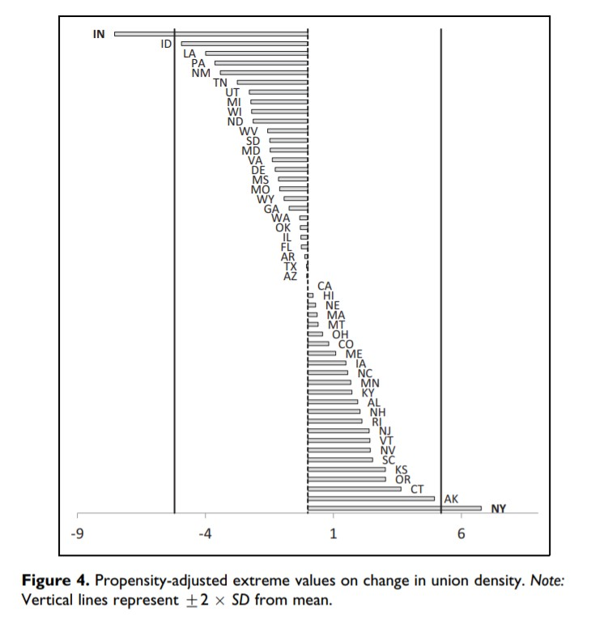
```

- **Indiana:** Union density declined *far more* than expected given its economic/political profile.
- **New York:** Union density declined *far less* than expected.

---

## Step 3: Discovery from Case Studies

**Indiana and New York** prompted a closer look at the *measurement* of union density.

Disaggregating into **private-sector** and **public-sector** components revealed:
- Indiana's extreme decline was driven by *private-sector* losses.
- New York's stability was driven by high *public-sector* union density.

**Result:** The revised model showed that **baseline public-sector union density** was the key predictor—a finding missed by standard approaches.

---

## Step 4: Iterative Refinement

The authors then:
1. Re-ran the analysis with public-sector union density as the treatment.
2. Computed *new* propensity-adjusted scores.
3. Selected **Missouri** as the next surprising case.
4. Discovered the role of state labor federations (AFL-CIO) and court-imposed bargaining limits.

**Key insight:** The case-selection list *changed* as knowledge accumulated—enabling a productive multi-method research cycle.

---

## The Iterative Multi-Method Cycle

1. Estimate regression with current knowledge.
2. Compute propensity-adjusted $X^*$.
3. Select and study surprising cases qualitatively.
4. Revise measurement, add confounders, refine theory.
5. Repeat.

---

## When to Use Surprising Causes

| Goal | Recommended Case Type |
|:-----|:----------------------|
| Discover measurement error in $X$ | Surprising causes ($X^*$) |
| Discover causal pathway | Surprising causes ($X^*$) |
| Find new confounding variables | Surprising causes ($X^*$) |
| Test a known pathway | Typical or deviant cases |
| Investigate extreme values of $Y$ | Deviant cases |

---
### What Should We Do With Our Cases?

Now that we've selected cases, what should we do with them?

-   What goals for discovery, and corresponding qualitative designs, are most valuable in multi-method research?

1.  Measurement tests
2.  Confounding variables
3.  Causal pathways (?)

---
### Measurement

1.  Use in-depth exploration of one or a few cases for qualitative
    correspondence test.

2.  Process trace the quantitative measurement process to form a theory
    for the causes of any errors.

3.  Qualitatively examine a few other cases that would be likely to
    suffer from the same kinds of errors to test the theory.

4.  Revise the coding for all relevant cases.

---

## The Problem: Do Democracy Indices Measure What They Claim?

We use quantitative indices like Polity IV, Vanhanen, and Gasiorowski as *dependent* or *independent* variables in regressions.

**But what if the numbers are wrong?**

- Bowman, Lehoucq, and Mahoney (2005) systematically compare three leading democracy indices for five Central American countries.
- Their finding: **Data-induced measurement error is pervasive.**

---

## How Bad Is the Disagreement?

For the same countries in the same years, the indices frequently diverge by massive margins.

| Country | Years with Major Disagreement (≥10 points on 0–20 scale) |
|:--------|:--------------------------------------------------------:|
| Costa Rica | 58 (all before 1958) |
| Honduras | 49 |
| Guatemala | 36 |
| El Salvador | 30 |
| Nicaragua | 10 |

---

Correlations among indices for the first half of the 20th century average **only 0.22**.

---

## Why Do They Disagree? It's Not the Aggregation Rules

Bowman et al. compare their own index (BLM) with Mainwaring, Brinks, and Pérez-Liñán (MBP).

- The two indices use **nearly identical** conceptualization and aggregation rules.
- Yet correlations are only **0.59 for Costa Rica** and **0.77 for Honduras**.

**Conclusion:** The problem is *not* primarily about how we add up scores.  
The problem is **knowing what actually happened** in each country-year.

---

## The Costa Rica Example: A "Perfect Democracy" with a Military Coup

.pull-left[
**Polity IV codes Costa Rica as a perfect democracy (+10) for *every year* from 1900 to 1999.**

This implies:
- Fully competitive elections
- Full civilian control of the military
- No restrictions on participation or liberties
]

.pull-right[
**What actually happened in Costa Rica?**

- **1917:** Minister of Defense Federico Tinoco overthrew President Alfredo González in a military coup.
- **1948:** A civil war brought the Revolutionary Junta to power, which governed for 18 months without elections.
]

---

## Why Did Polity IV Get It So Wrong?

**Source:** Bowman, Lehoucq, and Mahoney (2005, p. 8)

> "The erroneous idea that Costa Rica has been democratic since 1889... can be found not only in travel guides but also in scholarly writing and reference books."

The coders relied on **superficial secondary sources** that repeated the myth of uninterrupted Costa Rican democracy.

---

**Qualitative case expertise reveals:**
- Federico Tinoco's 1917 coup (U.S. diplomatic records document it)
- Electoral fraud in the 1948 election (archival research shows Otilio Ulate likely lost)
- Political persecution and restricted competition in the 1950s

---
## Next Step

- Let's form a general hypothesis:

```{r, echo = FALSE, out.width="40%", fig.retina = 1, fig.align='center'}
dagify(Bad_Democracy_Measurement ~ Continuous_Democracy_Myth + Other_Stuff) %>%
    ggdag(text_col = "red", text_size = 3) +
    theme_dag()
```

---

-   What are some other countries that would represent excellent examples of a myth of continuous national democracy?

-   Do any of those countries have issues in their democratic history that we might want to double-check in terms of democracy scores?

---

```{r, out.width="70%", fig.align='center'}
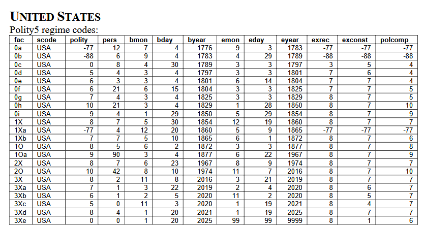
```

---
### Mechanisms vs. pathways

What is a **causal mechanism**?


---
### Can Process Tracing Test Causal Pathways?

-   Much depends on causal inference. Judea Pearl has shown that one can measure causal pathways via a process-tracing-like logic using a pair of assumptions.


---
### Assumptions for Testing Causal Pathways

-   Is the causal pathway "isolated" from other causal factors?

-   Is the causal pathway "exhaustive"?


---

```{r, out.width="70%", fig.align='center'}
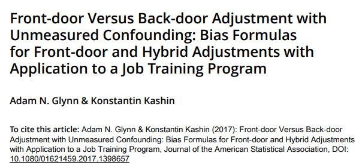
```

---

```{r, out.width="70%", fig.align='center'}
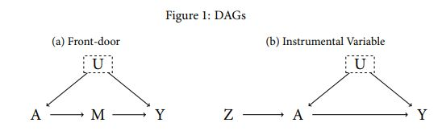
```

---

```{r, out.width="70%", fig.align='center'}
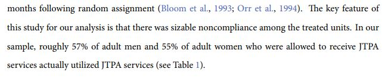
```


---

```{r, out.width="70%", fig.align='center'}
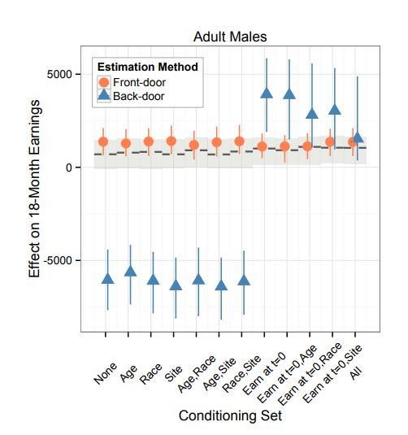
```

---

```{r, out.width="70%", fig.align='center'}
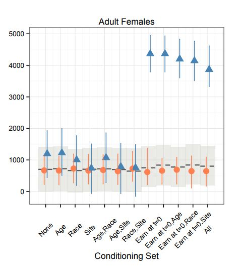
```

---
### Exploring Outliers

- Do we need to account for every outlier in a regression?

---
### Exploring Outliers

```{r, echo = FALSE, out.width="70%", fig.retina = 1, fig.align='center'}
library(knitr)
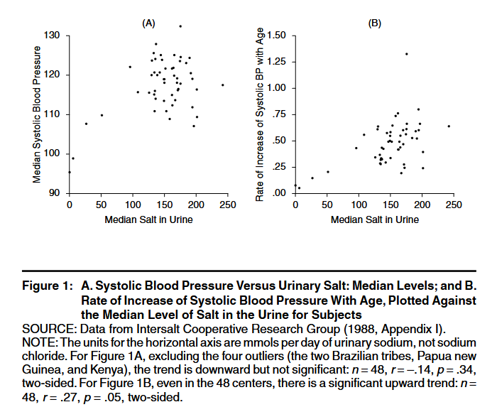
```

---
### Confounders

1.  Trace the causes of the cause, then forward to $Y$: triangular
    process-tracing design.

2.  Examine the $X$ to $Y$ causal pathway for any influence by potential
    causes of the cause.


---

### A Crucial Point: Control Variables and Causal Assumptions

Not all control variables are created equal.  
Some controls *create* bias rather than remove it.

---

### Good Control Variables

A good control is a **confounder**: it causes both the treatment and the outcome.


```{r, out.width="70%", fig.align='center'}
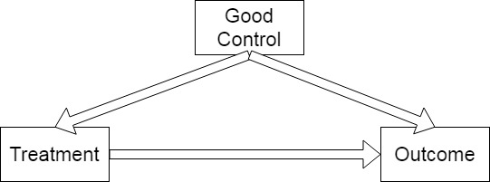
```

Controlling for the confounder blocks the non-causal pathway.

---

### Harmful Control Variables: Post-Treatment Bias

Controlling for a variable that is **caused by the treatment** introduces bias by removing part of the relevant causal story.

```{r, out.width="70%", fig.align='center'}

```

*Example:* Controlling for "trust in government" when estimating the effect of democracy on growth (democracy may affect trust).

---

### Harmful Control Variables: Collider Bias

Controlling for a **collider** (a common *effect* of treatment and outcome) induces a spurious correlation.

```{r, out.width="70%", fig.align='center'}

```

*Example:* Controlling for "being a swing state" when studying campaign spending and vote share.

---

Can we use qualitative evidence to help differentiate among these categories of variables?

---

class: center, middle

# Block 3: Hands-On Lab: Regression, Case Studies, and Case Selection

---

### Lab Objectives

1. Run a regression on the `inequality` dataset.
2. Interpret coefficient changes when adding control variables.
3. Identify deviant and extreme cases using R.
4. Design a qualitative follow-up for selected cases.

---

### Step 1: Load and Explore the Data

```{r, eval=FALSE, echo=TRUE}
inequality <- read.csv("https://raw.githubusercontent.com/jnseawright/practice-of-multimethod/main/data/inequality.csv")
names(inequality)
head(inequality)
```

- **Gini:** Gini coefficient (inequality, 0–100)
- **Polity:** Polity IV democracy score (-10 to +10)
- **GDP:** GDP per capita
- **Country:** Country name

---

### Step 2: Bivariate Regression

```{r, eval=FALSE, echo=TRUE}
m1 <- lm(OUTCOMEVARIABLE ~ TREATMENTVARIABLE, data = inequality)
summary(m1)
```

- What is the estimated relationship between democracy and inequality?
- Is it statistically significant?
- Is it *causally* identified? What assumptions are required?

---

### Step 3: Add a Control Variable

```{r, eval=FALSE, echo=TRUE}
m2 <- lm(OUTCOMEVARIABLE ~ TREATMENTVARIABLE + CONTROLVARIABLE(S), data = inequality)
summary(m2)
```

- How does the coefficient on `Polity` change?
- Why might controlling for GDP matter?
- Is GDP a *good* control or a *bad* control? Draw a DAG.

---

### Step 4: Identify Deviant Cases

```{r, eval=FALSE, echo=TRUE}
inequality$residuals <- residuals(m2)
inequality$deviance <- abs(inequality$residuals)

# Top 5 deviant cases
inequality[order(inequality$deviance, decreasing = TRUE), 
           c("Country", "Gini", "Polity", "GDP", "residuals")][1:5, ]
```

- Which countries are most poorly predicted by the model?
- What might explain their large residuals? (Measurement error? Omitted variables?)

---

### Step 5: Identify Extreme Cases on $X$

```{r, eval=FALSE, echo=TRUE}
# Extreme on Polity (democracy)
inequality$extreme_polity <- abs(inequality$Polity - mean(inequality$Polity, na.rm = TRUE))
inequality[order(inequality$extreme_polity, decreasing = TRUE), 
           c("Country", "Polity")][1:5, ]
```

- Which countries are most democratic? Most autocratic?
- Why might we want to study these extremes?

---

### Group Activity: Designing Qualitative Follow-Ups

**Scenario:** You have selected **Yemen** and **Zimbabwe** for in-depth study.

**Task (15 minutes in small groups):**

1.  Reverse engineer the case-selection rule. How were these two cases chosen from the data and the models that you've used so far today?

---

2. For **Yemen**: What qualitative evidence would you gather to discover:
   - Sources of measurement error, especially in the main causal variable?
   - An omitted confounder
   - Any ideas about causal pathways

---

3. For **Zimbabwe**: What qualitative evidence would you gather to discover:
   - Sources of measurement error, especially in the main causal variable?
   - An omitted confounder
   - Any ideas about causal pathways
 
4. Are there any changes we should want to make to our regressions based on these cases?

---

### Wrap-Up: Snow on Cholera Revisited

Let's return to [John Snow](https://johnsnow.matrix.msu.edu/documentUploads/15-78-52/15-78-52-22-1855-MCC2.pdf). Focus on pages 68-81.

- Identify the **quantitative** components of Snow's argument.
- Identify the **qualitative** components.
- How did Snow's integration of methods make his causal inference more powerful than a purely quantitative or purely qualitative study would have been?


